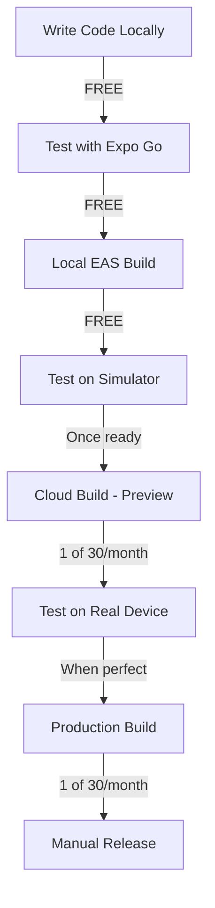

# 🛡️ FREE TIER PROTECTION RULES
**CRITICAL**: Solo developer with ZERO budget. NO paid services allowed.

## 🚨 ABSOLUTE LIMITS

### GitHub Actions (Free Tier: 2,000 minutes/month)
- **MAX daily runs**: 10 workflows
- **MAX runtime per workflow**: 5 minutes
- **MAX concurrent workflows**: 1
- **Schedule frequency**: NEVER more than 2x per day
- **Safety margin**: Target <1,000 minutes/month (50% of limit)

### Expo EAS (Free Tier: 30 builds/month)
- **MAX builds per week**: 5
- **Build triggers**: MANUAL ONLY (never automatic)
- **Build profiles**: Development only (no production builds until ready)
- **iOS builds**: Only when absolutely necessary (they're slower/costlier)

## ⛔ FORBIDDEN PATTERNS

### NEVER DO THIS:
```yaml
# ❌ FORBIDDEN: High-frequency schedules
schedule:
  - cron: '*/15 * * * *'  # NEVER!
  - cron: '*/30 * * * *'  # NEVER!
  - cron: '0 * * * *'     # NEVER! (hourly is too much)

# ❌ FORBIDDEN: Multiple triggers
on:
  push:
  pull_request:
  issues:      # NEVER combine these!
  schedule:

# ❌ FORBIDDEN: No concurrency control
# (missing concurrency group)

# ❌ FORBIDDEN: Long-running jobs
timeout-minutes: 60  # NEVER! Max should be 10

# ❌ FORBIDDEN: Matrix builds without limits
strategy:
  matrix:
    node: [14, 16, 18, 20]  # This creates 4x the runs!
```

## ✅ APPROVED PATTERNS

### ALWAYS DO THIS:
```yaml
# ✅ APPROVED: Low-frequency schedule
schedule:
  - cron: '0 6 * * *'  # Once daily max

# ✅ APPROVED: Concurrency control
concurrency:
  group: ${{ github.workflow }}
  cancel-in-progress: true

# ✅ APPROVED: Timeout protection
timeout-minutes: 5

# ✅ APPROVED: Manual trigger with dry-run
workflow_dispatch:
  inputs:
    dry_run:
      type: boolean
      default: true

# ✅ APPROVED: Skip conditions
if: github.actor != 'dependabot[bot]'
```

## 📊 MONTHLY BUDGET CALCULATOR

### GitHub Actions
```
Free tier: 2,000 minutes
Safety target: 1,000 minutes (50% buffer)

Daily budget: 33 minutes
- CI runs: 2 runs × 5 min = 10 min
- Automation: 1 run × 5 min = 5 min
- Buffer: 18 min

Monthly total: ~500-750 minutes (SAFE)
```

### Expo EAS
```
Free tier: 30 builds/month
Safety target: 15 builds (50% buffer)

Weekly budget: 3-4 builds
- Dev builds: 2-3
- Production: 1 (only when needed)

Monthly total: ~12-15 builds (SAFE)
```

## 🔒 ENFORCEMENT RULES

### 1. Pre-commit Checks
```bash
# Add to .husky/pre-commit
./scripts/check-free-tier.sh
```

### 2. Workflow Audit Script
```bash
#!/bin/bash
# scripts/check-free-tier.sh

# Check for dangerous schedules
if grep -r "cron.*\*/[0-9]\+" .github/workflows/*.yml; then
  echo "❌ ERROR: High-frequency schedule detected!"
  exit 1
fi

# Check for timeout limits
if grep -r "timeout-minutes: [0-9]\{2,\}" .github/workflows/*.yml; then
  echo "❌ ERROR: Workflow timeout too high (>10 min)!"
  exit 1
fi

# Check for matrix builds
if grep -r "matrix:" .github/workflows/*.yml; then
  echo "⚠️ WARNING: Matrix builds multiply costs!"
fi
```

### 3. Cost Monitoring Workflow
```yaml
name: Free Tier Guardian
on:
  schedule:
    - cron: '0 0 * * 1'  # Weekly on Monday
  workflow_dispatch:

jobs:
  check-usage:
    runs-on: ubuntu-latest
    timeout-minutes: 2
    steps:
      - name: Check GitHub Actions usage
        env:
          GH_TOKEN: ${{ secrets.GITHUB_TOKEN }}
        run: |
          # Count this month's runs
          RUNS_THIS_MONTH=$(gh api repos/${{ github.repository }}/actions/runs \
            --jq '[.workflow_runs[] | select(.created_at | startswith("2025-09"))] | length')
          
          # Estimate minutes (5 min average)
          EST_MINUTES=$((RUNS_THIS_MONTH * 5))
          
          if [ $EST_MINUTES -gt 1000 ]; then
            echo "⚠️ WARNING: Approaching free tier limit!"
            echo "Used: ~$EST_MINUTES / 2000 minutes"
            
            # Create warning issue
            gh issue create \
              --title "⚠️ GitHub Actions: Approaching Free Tier Limit" \
              --body "Estimated usage: $EST_MINUTES minutes. Reduce automation NOW!"
          fi
```

## 🚀 EAS BUILD PROTECTION

### eas.json Configuration
```json
{
  "cli": {
    "version": ">= 5.0.0"
  },
  "build": {
    "development": {
      "developmentClient": true,
      "distribution": "internal",
      "ios": {
        "simulator": true  // Simulator builds are faster/free
      }
    },
    "preview": {
      "distribution": "internal",
      "env": {
        "EXPO_NO_TELEMETRY": "1"
      }
    },
    "production": {
      "autoIncrement": false,  // Prevent accidental builds
      "env": {
        "MANUAL_BUILD_ONLY": "true"  // Require explicit flag
      }
    }
  },
  "submit": {
    "production": {
      "ios": {
        "ascApiKeyPath": null  // Prevent auto-submit
      },
      "android": {
        "serviceAccountKeyPath": null  // Prevent auto-submit
      }
    }
  }
}
```

### Build Commands (MANUAL ONLY)
```bash
# Development builds (FREE TIER SAFE)
eas build --profile development --platform ios --local  # Local = free
eas build --profile development --platform android --local

# Cloud builds (COUNT AGAINST LIMIT)
# Only use when absolutely necessary!
eas build --profile preview --platform android  # Uses 1 of 30

# NEVER use these:
# eas build --auto-submit  ❌
# eas build --platform all ❌ (doubles the count)
```

## 📱 LOCAL DEVELOPMENT FIRST

### Always prefer local/free options:
1. **Local Expo Dev**: `npx expo start` (FREE)
2. **Local EAS Build**: `eas build --local` (FREE)
3. **iOS Simulator**: No device needed (FREE)
4. **Android Emulator**: No device needed (FREE)
5. **Web Testing**: `npx expo start --web` (FREE)

### Only use cloud services when:
- Sharing preview with others
- Final production release
- Testing on real devices

## 🎯 ZERO-COST DEVELOPMENT WORKFLOW



## 🔴 EMERGENCY SHUTDOWN

If approaching limits:
```bash
# Disable ALL workflows immediately
for workflow in $(gh workflow list --all --json id -q '.[].id'); do
  gh workflow disable $workflow
done

# Cancel all running workflows
gh run list --status in_progress --json databaseId -q '.[].databaseId' | \
  xargs -I {} gh run cancel {}

# Stop all EAS builds
eas build:cancel --all
```

## 📞 SUPPORT TEMPLATES

### GitHub Billing Issue
```
Subject: Student/Open Source Free Tier Request

I'm a solo developer working on an open-source project with zero budget.
I accidentally exceeded the free tier due to a configuration error.
Repository: IgorGanapolsky/SuperPassword
Request: One-time forgiveness and account restriction to free tier only.
```

### Expo Support
```
Subject: Free Tier Only - Accidental Build Overflow

I'm a solo developer with no budget for paid services.
Please restrict my account to free tier only to prevent charges.
Project: @igorGanapolsky/SuperPassword
Request: Hard limit at 30 builds/month with automatic blocking.
```

---

**Remember**: Every workflow run, every build, every minute counts. When in doubt, DON'T RUN IT. Manual is better than bankrupt.
