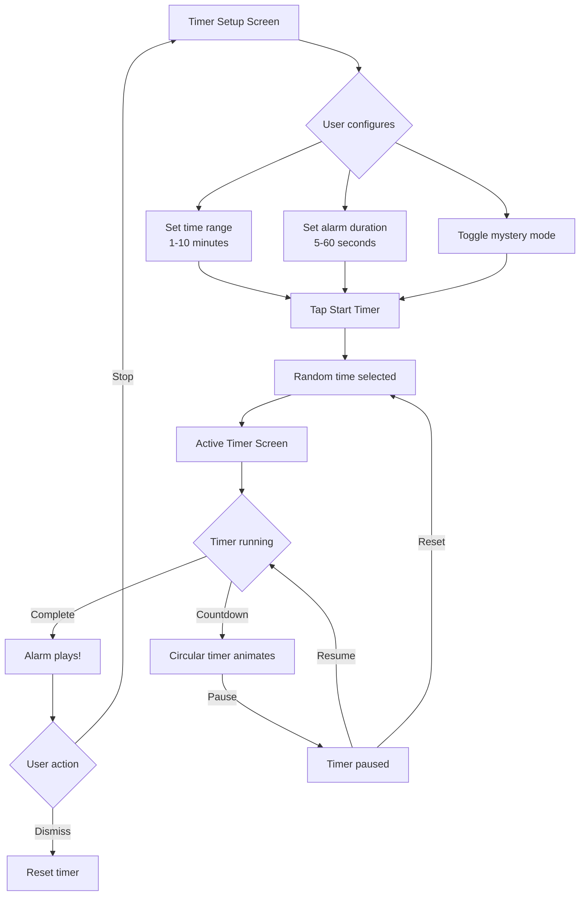

# Random Timer App

## Overview

A premium **Random Timer** app built with React Native (Expo dev-client) for iOS, Android, and web. Features a modern 2026 UI/UX design with glassmorphism, micro-animations, and haptic feedback.

## Key Features

- **Random Timer Range**: Set a min/max time range, and the timer picks a random duration
- **Alarm Duration Control**: Configure how long the alarm sounds
- **Mystery Mode**: Hide the remaining time for added suspense 🎭
- **Persistent Settings**: Your preferences are saved between sessions
- **Premium Visuals**: Glassmorphism cards, gradient backgrounds, animated circular timer

---

## Project Structure

```
src/
├── app/                    # App shell & bootstrap
│   ├── App.tsx             # Root component with font loading
│   ├── bootstrap/          # Font loading, splash screen hooks
│   └── components/         # AppProviders wrapper
│
├── features/timer/         # Timer feature module
│   ├── components/
│   │   ├── CircularTimer   # Animated SVG countdown
│   │   ├── RangeSlider     # Dual-thumb time range picker
│   │   ├── DurationPicker  # Alarm duration selector
│   │   └── TimerControls   # Play/Pause/Reset buttons
│   ├── hooks/
│   │   └── useRandomTimer  # Core timer logic
│   ├── services/
│   │   ├── soundService    # Alarm audio playback
│   │   └── storageService  # Settings persistence
│   └── screens/
│       ├── TimerSetupScreen    # Configure timer settings
│       └── ActiveTimerScreen   # Active countdown display
│
├── navigation/             # React Navigation setup
│   └── AppNavigation.tsx   # Stack navigator
│
└── shared/                 # Shared utilities & components
    ├── components/
    │   ├── Screen          # Gradient background wrapper
    │   ├── GlassCard       # Glassmorphism card
    │   ├── Button          # Animated button with haptics
    │   └── Text            # Typography presets
    ├── hooks/
    │   └── useHaptics      # Cross-platform haptic feedback
    └── theme/
        ├── colors          # Premium color palette
        ├── typography      # Inter + Space Mono fonts
        ├── spacing         # 4px base scale
        └── timing          # Animation spring configs
```

---

## Design System

### Colors

| Token          | Value     | Usage                  |
| -------------- | --------- | ---------------------- |
| `background`   | `#0F0A1A` | Deep purple-black      |
| `primary`      | `#6366F1` | Indigo accent          |
| `timerActive`  | `#10B981` | Green - time remaining |
| `timerWarning` | `#F59E0B` | Amber - almost done    |
| `timerDanger`  | `#EF4444` | Red - expired          |

### Typography

- **Inter**: Primary UI font (headings, body, buttons)
- **Space Mono**: Timer display (large monospace countdown)

### Animations

All animations use **React Native Reanimated** spring configs for smooth, natural motion:

- `snappy`: Buttons, toggles (damping: 20, stiffness: 300)
- `gentle`: Page transitions (damping: 25, stiffness: 120)
- `bouncy`: Playful elements (damping: 10, stiffness: 180)

---

## How to Run

### Prerequisites

- Node.js 20+
- Xcode (for iOS)
- Android Studio (for Android)

### Commands

```bash
# Install dependencies
npm install

# Start Metro bundler
npm start

# Run on iOS Simulator
npm run ios

# Run on Android Emulator
npm run android

# Run on iOS device
npm run ios:device

# Run on Android device
npm run android:device
```

---

## User Flow



---

## Verification

✅ **TypeScript compilation**: Passes with no errors
✅ **Dependencies installed**: All packages resolved
⏳ **Cross-platform testing**: Ready for manual testing

### Next Steps

1. Run `npm run ios` to test on iOS Simulator
2. Run `npm run android` to test on Android Emulator
3. Add a custom alarm sound to `assets/sounds/alarm.mp3`
4. Run `npx expo prebuild --clean` if native modules need rebuilding
