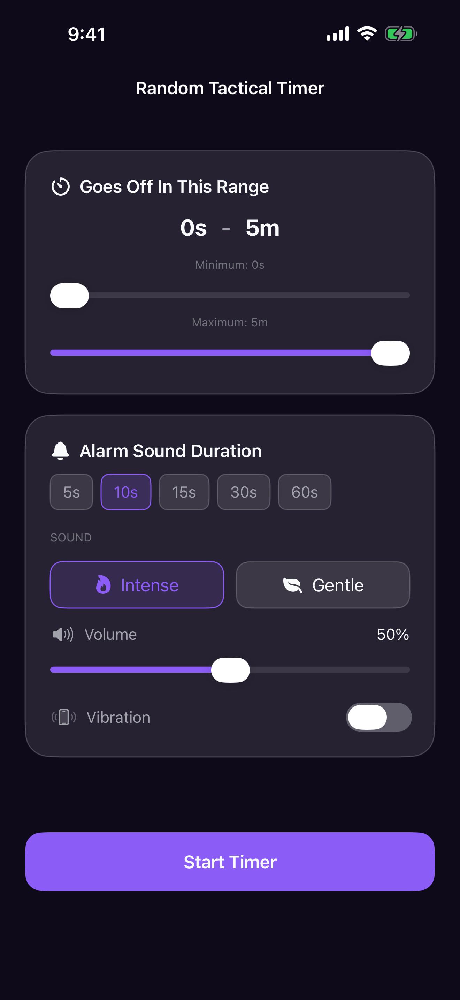
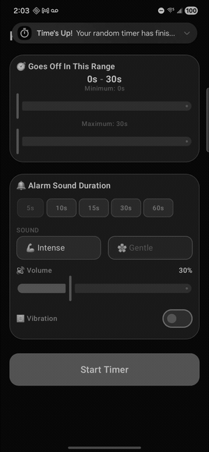

# Random Tactical Timer

[](LICENSE)
[](native-ios/)
[](native-android/)
[](https://github.com/IgorGanapolsky/Random-Timer/actions/workflows/ci.yml)
[](native-ios/)
[](native-android/)
[](native-android/)

A native **iOS + Android** timer that goes off at a **random** time within your chosen range. Set min and max — the app picks a random moment to ring. You never know exactly when.

**Built for** athletes, coaches, trainers, and anyone who needs unpredictable timing — workout intervals, reaction drills, team activities, meditation, and anywhere predictable timing defeats the purpose.

No ads. No tracking. No subscriptions. Just a timer that works.

<!-- Store badges — uncomment when live
[](https://apps.apple.com/app/random-tactical-timer/id...)
[](https://play.google.com/store/apps/details?id=com.iganapolsky.randomtimer)
-->

---

## Screenshots

<table>
  <tr>
    <th>iOS — Setup</th>
    <th>iOS — Timer Running</th>
    <th>Android — Setup</th>
    <th>Android — Loop Mode</th>
  </tr>
  <tr>
    <td></td>
    <td></td>
    <td></td>
    <td></td>
  </tr>
</table>

## Demo

<p align="center">
  
</p>

## Screenshots

<p align="center">
  
  
</p>

## Features

- **Random Timer Range** — set min/max time (e.g. 1–5 minutes), the app picks a random duration
- **Hidden Mode** — conceals the countdown so you can't anticipate the alarm
- **Loop Mode** — automatically restarts with a new random duration when the timer finishes
- **Lock Screen Display** — iOS Live Activity + Android notification with pause/resume/stop controls
- **Alarm Sounds** — choose Intense or Gentle, with adjustable volume and vibration
- **Premium Dark UI** — glassmorphism theme with Material Design 3 Expressive (Android) and SwiftUI (iOS)
- **Background Operation** — reliable notifications even when the app isn't in the foreground
- **Pause, Resume, Reset** — full timer controls on both platforms
- **Tap to Silence** — tap the timer circle during alarm to silence immediately

## Platforms

| Platform | Technology | Min Version |
|----------|------------|-------------|
| iOS | Swift 6 + SwiftUI + Live Activities | iOS 18+ |
| Android | Kotlin 2.1 + Jetpack Compose + Material Design 3 | Android 8+ (API 26) |

## Project Structure

```
native-ios/
├── RandomTimer/
│   └── Sources/
│       ├── App/           # SwiftUI App entry
│       ├── Services/      # TimerManager, Storage, Notifications
│       └── UI/
│           ├── Components/  # CircularTimer, GlassCard, Buttons
│           ├── Screens/     # TimerSetup, ActiveTimer
│           └── Theme/       # Colors
├── RandomTimerWidget/     # Live Activity for Lock Screen
└── SharedModels/          # Shared types

native-android/
└── app/src/main/
    ├── java/.../randomtimer/
    │   ├── domain/        # Models, UseCases, Repository
    │   ├── data/          # DataStore implementation
    │   ├── ui/            # Compose screens & components
    │   ├── service/       # Foreground service
    │   └── di/            # Hilt modules
    └── res/               # Drawables, sounds, themes
```

## Build & Run

### iOS

```bash
cd native-ios
open RandomTimer.xcodeproj
# Build and run from Xcode (Cmd+R)
```

Or via command line:
```bash
xcodebuild -scheme RandomTimer -destination 'platform=iOS Simulator,name=iPhone 17 Pro' build
```

### Android

```bash
cd native-android
./gradlew assembleDebug
./gradlew installDebug
```

## Testing

### Unit Tests

```bash
# Android
cd native-android && ./gradlew test

# iOS
xcodebuild test -scheme RandomTimer -destination 'platform=iOS Simulator,name=iPhone 17 Pro'
```

### E2E Tests (Maestro)

```bash
maestro test .maestro/smoke-test.yaml
```

### Agentic Web Verification (Playwright)

```bash
# Local deterministic checks (metadata + screenshot inventory)
make playwright-verify-local

# Strict release-readiness gate (enforces iPhone+iPad screenshot coverage)
make playwright-verify-strict

# Read-only App Store Connect / Play Console verification (requires auth state files)
make playwright-store-console

# Install agent-browser CLI used by the alternate verification engine
make playwright-install-agent-browser

# Read-only verification via agent-browser engine (same auth-state files)
make playwright-store-console-agent

# Sync local Playwright auth states to GitHub Actions secrets
make playwright-sync-auth-secrets
```

See `tests/playwright/README.md` for environment variables and strict release-readiness mode.
Platform tradeoff research is documented in `docs/agentic-browser-platform-evaluation-2026-02-16.md`.

## Review Ops Automation

Use the autonomous App Store review monitor to track ratings health, detect anomalies, and route actions:

```bash
python scripts/release_ops.py --repo-root . review_autopilot \
  --limit 200 \
  --sla-hours 24 \
  --mode observe \
  --history-jsonl /tmp/asc-reviews-history.jsonl \
  --reviews-json-out /tmp/asc-reviews-ops.json \
  --reviews-markdown-out /tmp/asc-reviews-ops.md \
  --anomaly-json-out /tmp/asc-reviews-anomaly.json \
  --anomaly-markdown-out /tmp/asc-reviews-anomaly.md \
  --policy-json-out /tmp/asc-reviews-policy.json \
  --policy-markdown-out /tmp/asc-reviews-policy.md
```

GitHub Actions workflow: `.github/workflows/ios-reviews-ops.yml`

- Runs every 6 hours and on manual dispatch
- Uploads review, anomaly, policy, and history artifacts
- Optional Slack notification via `ASC_REVIEWS_SLACK_WEBHOOK` secret
- Optional hard-fail on unresolved low-star SLA breaches (`fail_on_sla`)
- Optional hard-fail on policy blocking decisions (`fail_on_blocking`)

Generate a single release context snapshot (screenshots + metadata + optional ASC checks):

```bash
python scripts/release_ops.py check_readiness \
  --platform ios \
  --context-out /tmp/release-context.json \
  --strict-remote
```

Direct context script (without orchestration wrapper):

```bash
python scripts/release_context.py \
  --json-out /tmp/release-context.json
```

GitHub Actions workflow: `.github/workflows/ios-release-context.yml`

## Daily Growth Publishing

Automated daily blog + social distribution pipeline:

- Generates a short SEO-friendly engineering post
- Generates and scores keyword backlog using BID + AI-trap filtering
- Builds a PaperBanana-style tech-flow diagram (SVG + Mermaid)
- Publishes to DEV.to, LinkedIn, and X (when secrets are present)
- Deploys blog pages to GitHub Pages
- Collects engagement metrics, AI-bot traffic summaries, and app-download CTA tracking data
- Emits AI-agent friendly outputs: `llms.txt`, `agents.md`, and markdown post endpoints

Workflow: `.github/workflows/daily-growth-publishing.yml`  
Script: `scripts/growth_content_pipeline.py`  
Guide: `docs/DAILY_GROWTH_AUTOMATION.md`

Local dry-run:

```bash
python3 scripts/growth_content_pipeline.py \
  --repo-root . \
  --output-root marketing \
  run-daily \
  --dry-run
```
## App Store Version Automation

To avoid uploading metadata/screenshots to non-editable live versions, release tooling now resolves
an editable target App Store version before sync/submit steps.

Details and usage: `docs/APP_STORE_VERSION_AUTOMATION.md`
## Architecture

### iOS
- **MVVM** with `@Observable` TimerManager
- **Live Activities** for Lock Screen / Dynamic Island
- **UserDefaults** for persistence
- **AVAudioPlayer** for alarm sounds

### Android
- **Clean Architecture** with MVVM
- **Hilt** for dependency injection
- **DataStore** for persistence
- **Foreground Service** for reliable countdown
- **MediaPlayer** for alarm sounds
- **Material Design 3 Expressive** with spring-based animations and haptic feedback

## Color Palette

| Token | Preview | Value | Usage |
|-------|---------|-------|-------|
| Background |  | `#0F0A1A` | Deep purple-black |
| Accent |  | `#8B5CF6` | Purple primary |
| Timer Active |  | `#10B981` | Emerald — running |
| Warning |  | `#F59E0B` | Amber — warning |
| Alarm |  | `#F43F5E` | Rose — alarm |
| Timer Complete |  | `#8B5CF6` | Purple — done |
| Glass |  | `rgba(255,255,255,0.10)` | Card backgrounds |

## Contributing

See [CONTRIBUTING.md](CONTRIBUTING.md) for guidelines.

## Security

See [SECURITY.md](SECURITY.md) for vulnerability reporting.

## Privacy

Random Tactical Timer collects **no personal data**. See [PRIVACY_POLICY.md](PRIVACY_POLICY.md).

## License

[MIT](LICENSE) — Igor Ganapolsky
