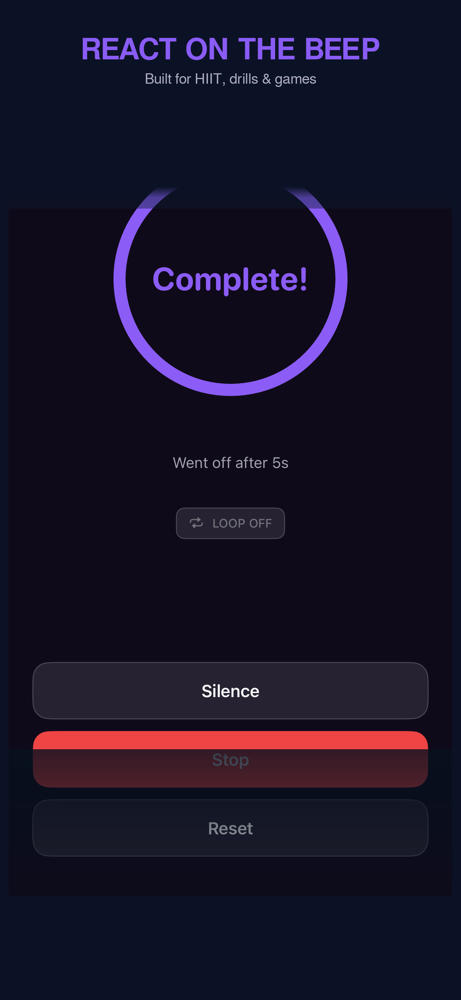
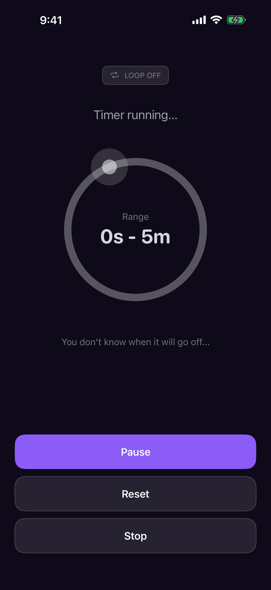
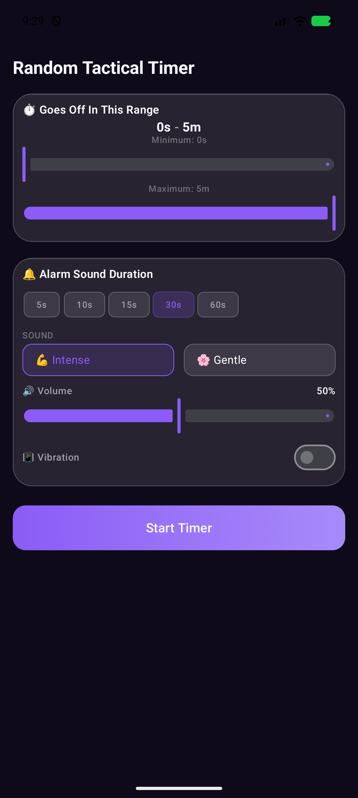
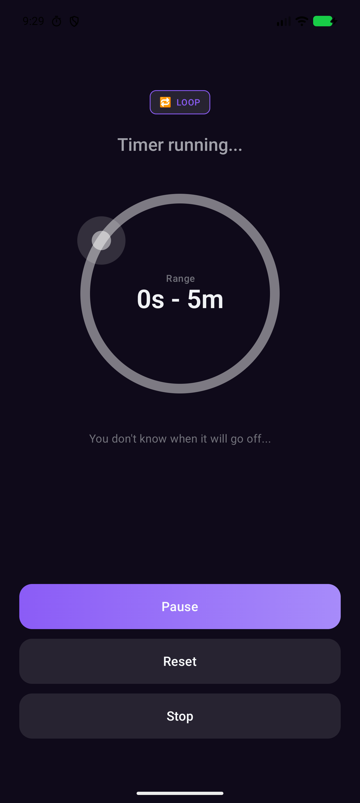

# Random Tactical Timer

[](LICENSE)
[](native-ios/)
[](native-android/)
[](https://github.com/IgorGanapolsky/Random-Timer/actions/workflows/ci.yml)
[](native-ios/)
[](native-android/)

**Train Reaction Under Stress.** A native **iOS + Android** timer built for combat sports, tactical drills, and stress inoculation. Unlike predictable round timers, this app triggers at random intervals so your nervous system can't anticipate the buzzer.

**Built for fighters, operators, and serious athletes.**

No ads. No tracking. No subscriptions. Pure performance.

---

## North Star (Defined February 23, 2026)

### Primary Metric

**Weekly Qualified Training Users (WQTU)** = distinct users with **>=3** `timer_completed` events in trailing 7 days.

This is the core metric because it captures repeated stress/reaction training behavior, not vanity traffic.

### Baseline (UTC)

- Snapshot date: `2026-02-24`
- `WQTU`: `0`
- `timer_completed` (7d): `2` events by `1` user
- `open_to_completed_rate` (30d): `24.24%` (`32/132`)
- Paid-attributed users (30d): `0`
- Downloads (30d): iOS `8`, Android `0`, combined `8`
- Apple Ads live dashboard: `0` campaigns and `0` spend rows in last 7 days

### Targets

- Checkpoint target (2026-03-31): `WQTU >= 8`
- Quarter target (2026-06-30): `WQTU >= 25`

### Are We On Track?

**Not yet.** As of February 24, 2026, paid-attributed acquisition is zero and Apple Ads has no live campaigns serving, so paid media is not moving WQTU.

### Benchmark Context (latest available by Feb 2026)

- Apple Ads benchmark summary (2024 performance): TTR `9.07%`, CR `66.70%`, CPT `$1.84`, CPA `$2.76` (MobileAction 2025 report).
- AppTweak U.S. search-results CPI benchmark: median CPI `\$4.06` overall, with lower-cost categories including Utilities (`\$2.90`) and higher-cost categories like Games (`\$12.28`).
- Business of Apps retention baseline: iOS D1 `23.9%` and D30 `3.7%`; Android D1 `21.1%` and D30 `2.1%`.
- Adjust retention benchmark baseline: global D1 `26%`, D30 `7%`; North America D1 `23%`, D30 `5%`.
- Sensor Tower (State of Mobile 2026): downloads up `0.8%` YoY to nearly `150B`; IAP revenue up `10.6%` YoY to `\$167B`.

### Practical Growth Rule

Use paid spend only when attribution is measurable and activation quality holds. Winning this product requires:

1. High-intent acquisition (combat/reaction positioning).
2. Strong activation (`open -> completed`).
3. Repeat weekly usage (`WQTU`) above all other topline metrics.

### Research Sources

- MobileAction Apple Ads 2025 Benchmark Executive Summary: https://www.mobileaction.co/report/apple-search-ads-2025-benchmark-report/executive-summary/
- AppTweak Apple Ads Benchmarks 2025: https://www.apptweak.com/en/aso-blog/apple-ads-benchmarks
- Business of Apps Retention Benchmarks: https://www.businessofapps.com/insights/app-retention-benchmarks/
- Adjust User Retention Benchmarks: https://www.adjust.com/resources/guides/user-retention/
- Sensor Tower State of Mobile 2026: https://sensortower.com/blog/state-of-mobile-2026

---

## Combat-Ready Visuals

### iOS (SwiftUI + Live Activities)
<p align="center">
  
  
  
  
</p>

### Android (Jetpack Compose + Material 3)
<p align="center">
  
  
  
  
</p>

---

## Features

- **Random Trigger Logic** — Set a range (e.g. 15s–90s); the alarm fires unpredictably.
- **Hidden Mode** — Conceals the countdown to force genuine reaction, not anticipation.
- **Loop Mode** — Continuous chaos rounds for high-intensity conditioning.
- **Tactical Alerts** — High-intensity audio + haptic feedback optimized for noisy environments.
- **Lock Screen Mastery** — iOS Live Activities and Android Foreground Services keep the timer active while your phone is locked.
- **Premium Dark UI** — High-contrast, glassmorphic design for maximum visibility in the gym.

## Technical Architecture

### iOS
- **Swift 6 + SwiftUI**
- **Live Activities** for the Dynamic Island and Lock Screen
- **AVAudioPlayer** for low-latency tactical alerts

### Android
- **Kotlin 2.1 + Jetpack Compose**
- **Clean Architecture** with Hilt Dependency Injection
- **Foreground Service** for bulletproof background reliability
- **Material Design 3 Expressive** with spring-based motion

## Build & Test

### iOS
```bash
cd native-ios
xcodebuild test -scheme RandomTimer -destination 'platform=iOS Simulator,name=iPhone 17 Pro'
```

### Android
```bash
cd native-android
./gradlew test
```

## License
[MIT](LICENSE) — Igor Ganapolsky
