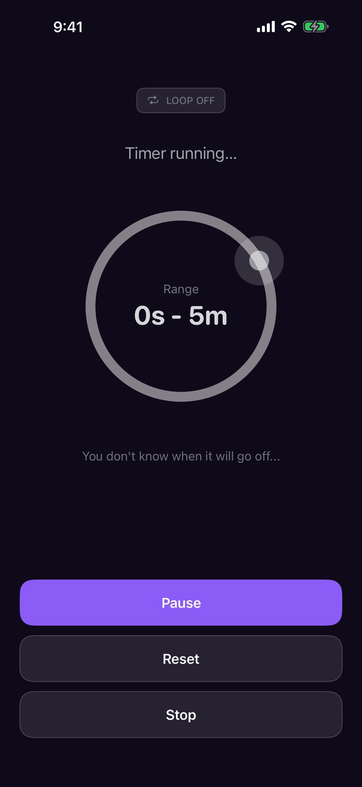
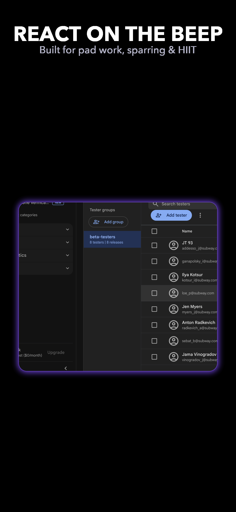
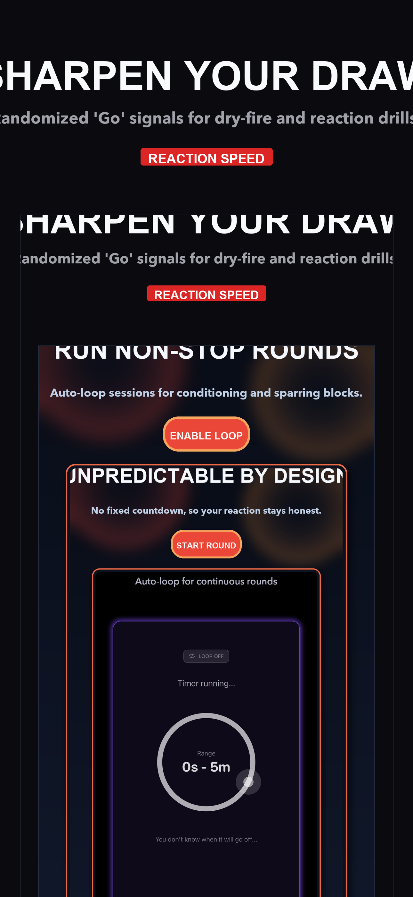
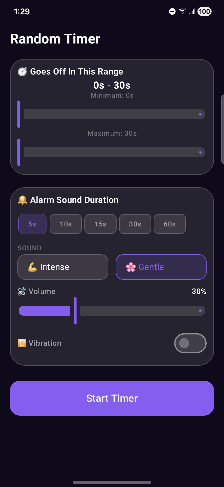
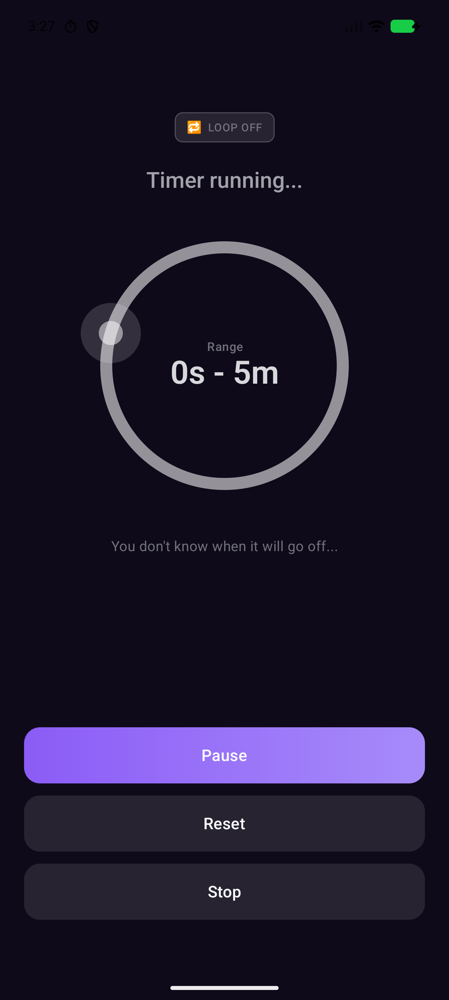
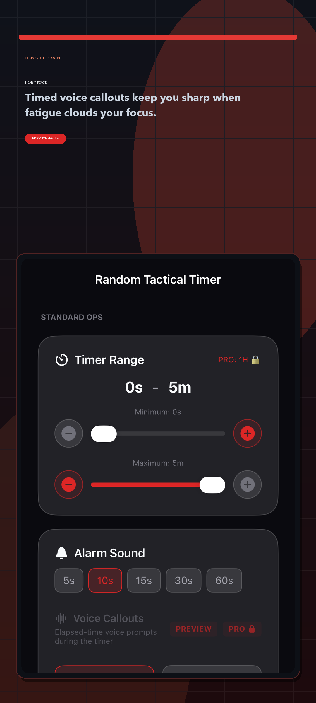
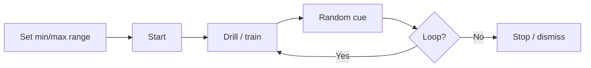
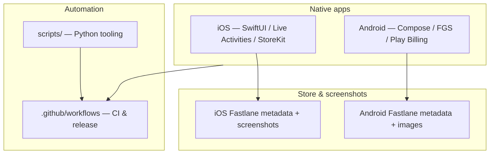

# Random Tactical Timer

[](LICENSE)
[](https://github.com/IgorGanapolsky/Random-Timer/actions/workflows/ci.yml)
[](native-ios/)
[](native-android/)

**Train reaction, not rhythm.** Native **iOS + Android** app: the buzzer fires at a **random** moment inside your range so you cannot anticipate it.

*Store-facing line:* **TRAIN FOR CHAOS. NOT RHYTHM.** — same headline as [App Store description](native-ios/fastlane/metadata/en-US/description.txt) and [Play Store full description](native-android/fastlane/metadata/android/en-US/full_description.txt) (en-US).

| Store | One-liner (en-US) |
|--------|-------------------|
| **App Store** subtitle | [Dry Fire, Boxing, BJJ, HIIT](native-ios/fastlane/metadata/en-US/subtitle.txt) |
| **Play** short description | [Random timer with male & female AI coach voice for combat sports and HIIT.](native-android/fastlane/metadata/android/en-US/short_description.txt) |

---

## Screenshots = store assets

Images below are **not** a second set of mocks — they are the **same files** shipped in Fastlane metadata (en-US).

**iPhone** (`native-ios/fastlane/screenshots/en-US/`)

<p align="center">
  
  
  
  
</p>

**Android phone** (`native-android/fastlane/metadata/android/en-US/images/phoneScreenshots/`)

<p align="center">
  
  
  
  
</p>

*iPad / additional iOS sizes: same folder (`5_ipad_*` … `7_ipad_*`).*

---

## Diagrams

### Training loop


```mermaid
flowchart LR
  A[Set min/max range] --> B[Start]
  B --> C[Drill / train]
  C --> D[Random cue]
  D --> E{Loop?}
  E -->|Yes| C
  E -->|No| F[Stop / dismiss]
```

### Repository layout


```mermaid
flowchart TB
  subgraph apps [Native apps]
    iOS[iOS — SwiftUI / Live Activities / StoreKit]
    AND[Android — Compose / FGS / Play Billing]
  end
  subgraph meta [Store & screenshots]
    FM[iOS Fastlane metadata + screenshots]
    AM[Android Fastlane metadata + images]
  end
  subgraph auto [Automation]
    PY[scripts/ — Python tooling]
    GA[.github/workflows — CI & release]
  end
  iOS --> FM
  AND --> AM
  apps --> GA
  PY --> GA
```

---

## Tech summary

| Layer | Stack |
|--------|--------|
| **iOS** | Swift 6, SwiftUI, Live Activities, AVFoundation alerts, StoreKit, PostHog |
| **Android** | Kotlin, Jetpack Compose, Hilt, foreground service, Play Billing, PostHog, Firebase crash/analytics |
| **Repo** | Python automation in [`scripts/`](scripts/), workflows in [`.github/workflows/`](.github/workflows/), Fastlane under each `native-*` tree |

## Build & verify

Entry point: **[`Makefile`](Makefile)**.

```bash
make verify
```

Details: iOS `native-ios/` (`xcodebuild`), Android `native-android/` (`./gradlew …`). See Makefile targets for simulators, Maestro, and platform-specific checks.

---

## Docs index

| Doc | Purpose |
|-----|---------|
| [`docs/REPO_PROFILE.md`](docs/REPO_PROFILE.md) | **GitHub About** text, topics, links — keep in sync with this README |
| [`docs/pr-review-bots.md`](docs/pr-review-bots.md) | PR review / bot matrix |
| [`docs/north-star-baseline.md`](docs/north-star-baseline.md) | Dated WQTU snapshot (verify live metrics in PostHog) |
| [`CLAUDE.md`](CLAUDE.md) | Operator rules, budgets, release flow |
| [`AGENTS.md`](AGENTS.md) | Agent / AI instructions |
| [`PRIVACY_POLICY.md`](PRIVACY_POLICY.md) | Privacy (linked from store metadata) |

## License

[MIT](LICENSE) — Igor Ganapolsky
