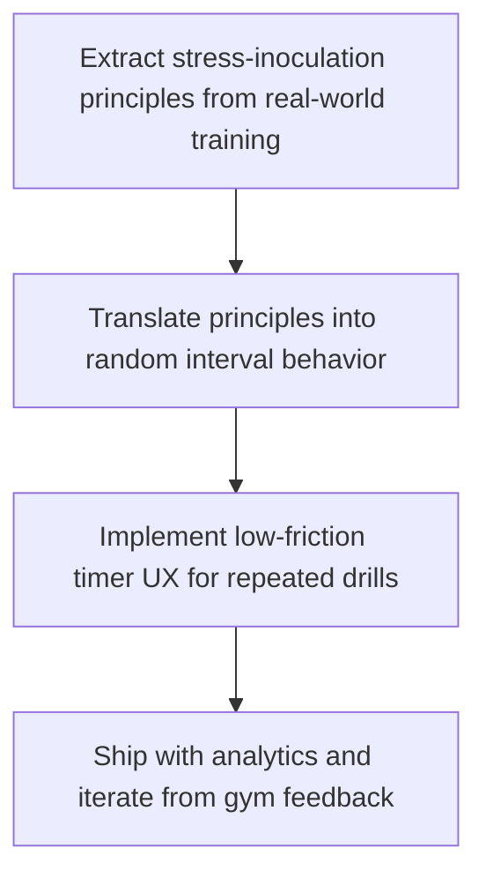

Predictable rounds build predictable reactions. Real pressure doesn't.

## Problem

Most interval timers teach anticipation. Fighters need response under uncertainty.

## Training Principle

Random cues force attention and decision-making instead of waiting for a known beep.

## Product Decision

We prioritized fast setup, hidden countdown behavior, and loopable random rounds over feature bloat.

## Diagram

PaperBanana render: https://igorganapolsky.github.io/Random-Timer/blog/diagrams/2026-02-20-the-inspiration-behind-random-tactical-timer.png

## Try the App

- iOS: https://apps.apple.com/us/app/random-tactical-timer/id6742267714?utm_source=github_pages&utm_medium=organic&utm_campaign=daily_blog_20260220&utm_content=blog_post
- Android: https://play.google.com/store/apps/details?id=com.iganapolsky.randomtimer&utm_source=github_pages&utm_medium=organic&utm_campaign=daily_blog_20260220&utm_content=blog_post

## Help Us Improve

- Leave an iOS review: https://apps.apple.com/us/app/random-tactical-timer/id6742267714?action=write-review
- Leave an Android review: https://play.google.com/store/apps/details?id=com.iganapolsky.randomtimer&reviewId=0