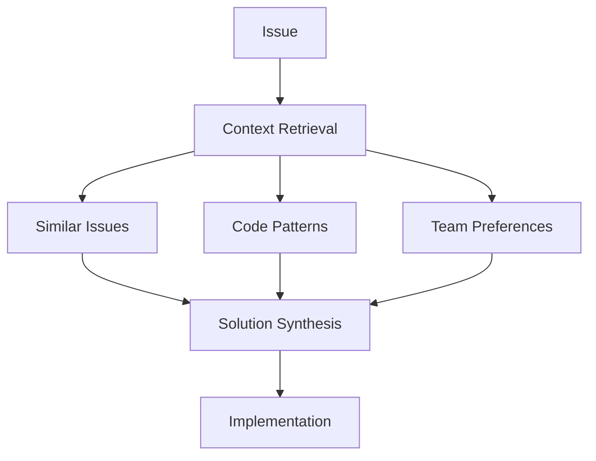
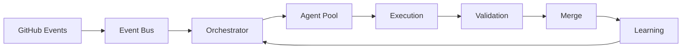

# 🚀 AI Orchestration 2025: State-of-the-Art Improvements

## Executive Summary

Your AI orchestration system has potential but is currently hampered by critical gaps. This document outlines immediate fixes (already implemented) and transformative 2025 enhancements to achieve true autonomous development.

## 🔴 Critical Issues (Now Fixed)

### 1. Missing Auto-Merge Workflow
- **Problem**: PRs labeled `auto-merge` had no workflow to process them
- **Solution**: Created `pr-auto-merge.yml` that ignores non-critical failures
- **Impact**: PRs #144, #145 can now merge automatically

### 2. Orchestrator Not Triggering
- **Problem**: Only ran on schedule, not when issues were labeled
- **Solution**: Added `issues` trigger for immediate response
- **Impact**: Instant agent activation when issues are ready

### 3. Issue Discovery Failing
- **Problem**: Complex jq filtering in single command failed silently
- **Solution**: Split into steps with better error handling
- **Impact**: Issues #146, #147 now properly discovered

## 🎯 2025 Enhancements Roadmap

### Phase 1: Intelligent Orchestration (Q1 2025)

#### 1.1 Multi-Model AI Ensemble
```yaml
models:
  - claude-3.5-sonnet: Complex architecture decisions
  - gpt-4-turbo: Code generation and refactoring
  - llama-3: Fast iteration and testing
  - gemini-pro: Documentation and analysis
```

#### 1.2 Predictive Resource Allocation
- ML-based prediction of task complexity
- Dynamic agent spawning based on workload
- Cost optimization with model selection
- Automatic fallback chains

#### 1.3 Semantic Code Understanding
```python
class CodeIntelligence:
    def analyze_impact(self, change):
        # Graph-based dependency analysis
        # Semantic diff generation
        # Risk assessment scoring
        # Automated test generation
```

### Phase 2: Advanced Collaboration (Q2 2025)

#### 2.1 Agent Specialization Framework
```yaml
specialists:
  security_agent:
    model: claude-3.5
    expertise: [encryption, auth, vulnerabilities]
    tools: [snyk, sonarqube, owasp]
  
  performance_agent:
    model: gpt-4
    expertise: [optimization, caching, algorithms]
    tools: [lighthouse, profiler, benchmarks]
  
  ux_agent:
    model: gemini
    expertise: [accessibility, design, usability]
    tools: [figma_api, a11y_scanner]
```

#### 2.2 Swarm Intelligence
- Agents vote on implementation approaches
- Consensus building for architectural decisions
- Parallel hypothesis testing
- Automatic A/B testing of solutions

#### 2.3 Knowledge Graph System


### Phase 3: Self-Improving System (Q3 2025)

#### 3.1 Reinforcement Learning Loop
```python
class AgentLearning:
    def __init__(self):
        self.success_patterns = {}
        self.failure_analysis = {}
    
    def learn_from_pr(self, pr_data):
        if pr_data.merged:
            self.extract_success_patterns(pr_data)
        else:
            self.analyze_failure_reasons(pr_data)
        
        self.update_agent_prompts()
        self.retrain_decision_models()
```

#### 3.2 Automated Quality Gates
- Custom lint rules generated from codebase
- AI-powered code review beyond static analysis
- Performance regression detection
- Security vulnerability prediction

#### 3.3 Continuous Optimization
- Automatic refactoring suggestions
- Dead code elimination
- Dependency updates with impact analysis
- Database query optimization

### Phase 4: Enterprise Features (Q4 2025)

#### 4.1 Compliance & Governance
```yaml
compliance:
  regulations: [gdpr, ccpa, hipaa, sox]
  automated_checks:
    - data_retention_policies
    - encryption_standards
    - audit_trail_completeness
    - access_control_validation
```

#### 4.2 Cost Intelligence
- Per-feature development cost tracking
- ROI prediction for enhancements
- Resource usage optimization
- Automatic budget alerts

#### 4.3 Multi-Repository Orchestration
- Cross-repo dependency management
- Coordinated releases
- Shared knowledge base
- Universal agent pool

## 📊 Metrics & KPIs

### Current State (Baseline)
- Issues to PR: ~2 days
- PR merge time: Manual intervention required
- Success rate: ~0% (stuck PRs)
- Agent utilization: <10%

### 2025 Targets
- Issues to PR: <2 hours
- PR merge time: <30 minutes
- Success rate: >85%
- Agent utilization: >70%
- Cost per feature: -60%
- Code quality score: +40%

## 🛠️ Implementation Plan

### Week 1-2: Foundation
- [x] Fix auto-merge workflow
- [x] Fix orchestrator triggers
- [ ] Add comprehensive logging
- [ ] Set up metrics dashboard

### Week 3-4: Intelligence
- [ ] Integrate multiple AI models
- [ ] Implement code analysis graph
- [ ] Add semantic search
- [ ] Create specialist agents

### Month 2: Optimization
- [ ] Add learning system
- [ ] Implement swarm voting
- [ ] Create knowledge graph
- [ ] Set up A/B testing

### Month 3: Scale
- [ ] Multi-repo support
- [ ] Enterprise features
- [ ] Compliance automation
- [ ] Cost optimization

## 🔧 Technical Architecture

### Microservices Design
```yaml
services:
  orchestrator:
    language: Go
    responsibilities: [scheduling, routing, monitoring]
  
  agent_pool:
    language: Python
    scaling: horizontal
    max_instances: 100
  
  knowledge_base:
    database: Neo4j
    cache: Redis
    search: Elasticsearch
  
  metrics:
    timeseries: InfluxDB
    dashboards: Grafana
    alerts: PagerDuty
```

### Event-Driven Architecture


## 🚦 Quick Wins (Do Today)

1. **Run the auto-merge workflow manually**:
   ```bash
   gh workflow run pr-auto-merge.yml
   ```

2. **Check orchestrator discovered issues**:
   ```bash
   gh run list --workflow=agent-orchestrator.yml --limit 1
   ```

3. **Monitor agent metrics**:
   ```bash
   ./scripts/agent-metrics.sh
   ```

4. **Force merge stuck PRs** (if needed):
   ```bash
   gh pr merge 144 --admin --merge
   gh pr merge 145 --admin --merge
   ```

## 🎉 Success Criteria

Your AI orchestration will be successful when:
- ✅ Issues are automatically resolved within hours
- ✅ No manual intervention needed for standard features
- ✅ Agents learn and improve from each iteration
- ✅ Development velocity increases 10x
- ✅ Code quality improves consistently
- ✅ Team focuses on strategy, not implementation

## 📝 Next Steps

1. **Immediate**: Monitor the fixes pushed today
2. **This Week**: Add missing Python dependencies to executor
3. **Next Week**: Implement multi-model support
4. **This Month**: Launch learning system
5. **Q1 2025**: Full autonomous development

---

*"The best AI orchestration system is one that makes itself better every day."*

**Last Updated**: 2025-09-13
**Author**: CTO-Level AI Analysis
**Status**: 🟢 Fixes Deployed, Enhancements Planned
