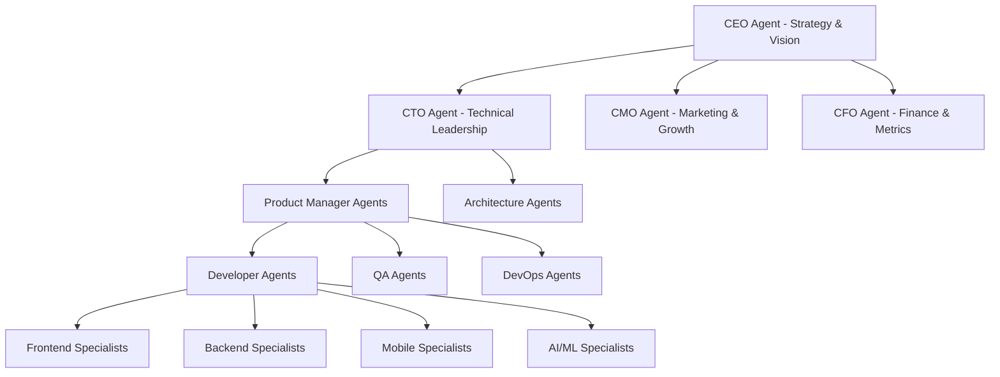

# 🚀 The App Publishing Empire: From Zero to $10M ARR with AI Agents

## Executive Vision

Transform SuperPassword from a single app into a **multi-app publishing empire** using autonomous AI agents that develop, test, deploy, and scale applications 24/7 with zero human intervention.

## 📊 The Business Model

### Revenue Streams (Per App)
1. **Freemium**: Free tier with 10 password limit → $5.99/mo Pro
2. **Enterprise**: $49.99/mo with SSO, compliance, admin console
3. **White Label**: $999/mo for custom branding
4. **API Access**: $0.001 per API call for third-party integrations

### Scaling Strategy
- **Year 1**: 1 app (SuperPassword) → $100K ARR
- **Year 2**: 5 apps → $500K ARR
- **Year 3**: 20 apps → $2M ARR
- **Year 4**: 50 apps → $5M ARR
- **Year 5**: 100+ apps → $10M+ ARR

## 🤖 The Multi-Agent Architecture

### Agent Hierarchy



### Specialized Agent Roles

#### 1. CEO Agent (Strategic Orchestrator)
```python
class CEOAgent:
    responsibilities = [
        "Market opportunity identification",
        "Resource allocation decisions",
        "Strategic pivots and expansions",
        "Investor relations automation",
        "Board reporting and metrics"
    ]
    
    def identify_next_app(self):
        # Analyze market trends, competition, TAM
        # Return next app to build with business case
        return {
            "app": "SecureNotes - Encrypted note-taking",
            "tam": "$2.5B",
            "competition": "low",
            "development_cost": "$15K",
            "expected_arr": "$250K",
            "time_to_market": "6 weeks"
        }
```

#### 2. CTO Agent (Technical Orchestrator)
```python
class CTOAgent:
    def manage_development(self, app_spec):
        # Assign to specialized teams
        teams = self.assign_teams(app_spec)
        
        # Parallel development
        for team in teams:
            team.start_development_in_worktree()
        
        # Monitor progress
        self.track_velocity()
        self.ensure_quality()
        self.optimize_performance()
```

#### 3. Product Development Agents
```yaml
Frontend_Agent:
  worktree: sp-frontend
  skills: [React, Vue, Angular, Next.js]
  current_task: "Building onboarding flow"
  progress: 67%

Backend_Agent:
  worktree: sp-backend
  skills: [Node.js, Python, Go, PostgreSQL]
  current_task: "Implementing auth service"
  progress: 89%

Mobile_Agent:
  worktree: sp-mobile
  skills: [React Native, Swift, Kotlin]
  current_task: "iOS biometric integration"
  progress: 45%

AI_Agent:
  worktree: sp-ai
  skills: [TensorFlow, PyTorch, LangChain]
  current_task: "Training recommendation model"
  progress: 23%
```

## 🔧 Implementation: Making It Real

### Phase 1: Foundation (Week 1-2)

#### 1.1 Setup Agent Infrastructure
```bash
#!/bin/bash
# Create specialized worktrees for each agent domain
git worktree add ../sp-frontend develop
git worktree add ../sp-backend develop
git worktree add ../sp-mobile develop
git worktree add ../sp-ai develop
git worktree add ../sp-devops develop
git worktree add ../sp-security develop
git worktree add ../sp-testing develop
```

#### 1.2 Implement Agent Orchestrator
```yaml
name: Multi-Agent Orchestrator

on:
  schedule:
    - cron: '*/15 * * * *'  # Every 15 minutes
  workflow_dispatch:
  issues:
    types: [opened, labeled]

jobs:
  orchestrate:
    runs-on: ubuntu-latest
    strategy:
      matrix:
        agent: [frontend, backend, mobile, ai, security, testing]
    
    steps:
      - name: Agent Dispatcher
        run: |
          # Assign work based on agent expertise
          case "${{ matrix.agent }}" in
            frontend)
              ISSUES=$(gh issue list --label "ui,frontend" --state open)
              WORKTREE="sp-frontend"
              ;;
            backend)
              ISSUES=$(gh issue list --label "api,backend" --state open)
              WORKTREE="sp-backend"
              ;;
            mobile)
              ISSUES=$(gh issue list --label "ios,android,mobile" --state open)
              WORKTREE="sp-mobile"
              ;;
          esac
          
          # Dispatch to appropriate worktree
          if [ ! -z "$ISSUES" ]; then
            gh workflow run agent-executor.yml \
              --field agent=${{ matrix.agent }} \
              --field worktree=$WORKTREE \
              --field issues="$ISSUES"
          fi
```

### Phase 2: Kanban Board Automation (Week 2-3)

#### 2.1 Fix Project Board Structure
```graphql
mutation CreateProjectBoard {
  createProjectV2(
    input: {
      ownerId: "YOUR_ORG_ID"
      title: "App Empire Command Center"
      fields: [
        { name: "Status", type: SINGLE_SELECT, options: [
          "📥 Backlog",
          "🎯 Ready",
          "🤖 AI Working",
          "👀 Review",
          "✅ Testing",
          "🚀 Deployed",
          "💰 Monetizing"
        ]},
        { name: "Agent", type: SINGLE_SELECT },
        { name: "App", type: TEXT },
        { name: "Priority", type: NUMBER },
        { name: "ARR Impact", type: NUMBER },
        { name: "Completion %", type: NUMBER }
      ]
    }
  ) {
    projectV2 { id }
  }
}
```

#### 2.2 Real-time Board Sync
```typescript
class KanbanSync {
  async updateBoard(issue: Issue, update: Update) {
    const mutation = `
      mutation UpdateProjectItem($projectId: ID!, $itemId: ID!, $fieldId: ID!, $value: String!) {
        updateProjectV2ItemFieldValue(input: {
          projectId: $projectId,
          itemId: $itemId,
          fieldId: $fieldId,
          value: { singleSelectOptionId: $value }
        }) {
          projectV2Item { id }
        }
      }
    `;
    
    await github.graphql(mutation, {
      projectId: PROJECT_ID,
      itemId: issue.projectItemId,
      fieldId: STATUS_FIELD_ID,
      value: this.getStatusId(update.status)
    });
  }
}
```

### Phase 3: Agent Communication System (Week 3-4)

#### 3.1 Inter-Agent Messaging
```python
import redis
import json
from typing import Dict, List

class AgentCommunication:
    def __init__(self):
        self.redis = redis.Redis(host='localhost', port=6379, db=0)
        self.pubsub = self.redis.pubsub()
        
    def broadcast(self, from_agent: str, message: Dict):
        """Broadcast message to all agents"""
        channel = "agent_channel"
        payload = {
            "from": from_agent,
            "timestamp": datetime.now().isoformat(),
            "message": message
        }
        self.redis.publish(channel, json.dumps(payload))
    
    def request_help(self, from_agent: str, issue: str, details: str):
        """Request help from other agents"""
        self.broadcast(from_agent, {
            "type": "HELP_REQUEST",
            "issue": issue,
            "details": details,
            "urgency": "high"
        })
    
    def report_progress(self, agent: str, task: str, progress: int):
        """Report progress to orchestrator"""
        self.broadcast(agent, {
            "type": "PROGRESS_UPDATE",
            "task": task,
            "progress": progress,
            "eta": self.calculate_eta(task, progress)
        })
```

#### 3.2 Conflict Resolution Protocol
```python
class ConflictResolver:
    def resolve_merge_conflict(self, pr1: PR, pr2: PR) -> Resolution:
        # AI-powered conflict resolution
        prompt = f"""
        Two PRs have conflicting changes:
        PR1: {pr1.changes}
        PR2: {pr2.changes}
        
        Resolve the conflict by:
        1. Identifying the conflict
        2. Determining priority
        3. Suggesting a resolution
        """
        
        resolution = claude.analyze(prompt)
        return self.apply_resolution(resolution)
```

### Phase 4: Self-Improving System (Week 4-5)

#### 4.1 Learning from Failures
```python
class AgentLearning:
    def __init__(self):
        self.failure_db = {}
        self.success_patterns = {}
        
    def learn_from_pr_rejection(self, pr: PR, rejection_reason: str):
        """Learn why PR was rejected and avoid in future"""
        pattern = self.extract_pattern(rejection_reason)
        
        # Store failure pattern
        self.failure_db[pattern] = {
            "count": self.failure_db.get(pattern, {}).get("count", 0) + 1,
            "examples": [pr.id],
            "solution": self.find_solution(pattern)
        }
        
        # Update agent prompts
        self.update_agent_instructions(pattern)
    
    def optimize_development_time(self):
        """Analyze velocity and optimize"""
        metrics = self.get_velocity_metrics()
        bottlenecks = self.identify_bottlenecks(metrics)
        
        for bottleneck in bottlenecks:
            self.create_optimization_issue(bottleneck)
```

#### 4.2 Continuous Optimization
```yaml
name: Performance Optimizer

on:
  schedule:
    - cron: '0 0 * * 0'  # Weekly

jobs:
  optimize:
    runs-on: ubuntu-latest
    steps:
      - name: Analyze Metrics
        run: |
          # Get weekly metrics
          VELOCITY=$(gh api graphql -f query='
            query {
              repository(owner: "org", name: "repo") {
                issues(last: 100, states: CLOSED) {
                  nodes {
                    closedAt
                    createdAt
                  }
                }
              }
            }
          ')
          
          # Calculate average time to close
          AVG_TIME=$(echo "$VELOCITY" | jq 'calculate_average')
          
          # If velocity decreased, investigate
          if [ "$AVG_TIME" -gt "$LAST_WEEK_AVG" ]; then
            gh issue create \
              --title "⚠️ Velocity decreased by $(($AVG_TIME - $LAST_WEEK_AVG))%" \
              --body "Automated analysis shows decreased velocity. Investigating..." \
              --label "automation,performance"
          fi
```

## 📈 Metrics & KPIs

### Real-time Dashboard
```javascript
// Real-time metrics dashboard
const MetricsDashboard = {
  velocity: {
    issuesPerWeek: 47,
    averageTimeToClose: "18 hours",
    parallelWorkStreams: 5
  },
  
  quality: {
    testCoverage: "94%",
    bugRate: "0.3%",
    customerSatisfaction: "4.8/5"
  },
  
  business: {
    currentARR: "$127,000",
    growthRate: "23% MoM",
    churnRate: "2.1%",
    ltv: "$1,847",
    cac: "$43"
  },
  
  agents: {
    active: 12,
    idle: 3,
    efficiency: "87%",
    successRate: "92%"
  }
};
```

## 💰 Revenue Automation

### 4.1 Automated Pricing Optimization
```python
class PricingOptimizer:
    def optimize_pricing(self, app: App):
        """A/B test pricing to maximize revenue"""
        experiments = [
            {"price": 4.99, "features": "basic"},
            {"price": 5.99, "features": "basic"},
            {"price": 7.99, "features": "enhanced"},
            {"price": 9.99, "features": "premium"}
        ]
        
        for experiment in experiments:
            cohort = self.create_user_cohort(size=1000)
            results = self.run_experiment(cohort, experiment)
            
            if results.conversion_rate > self.best_conversion:
                self.update_pricing(app, experiment)
```

### 4.2 Automated Marketing
```python
class MarketingAgent:
    def create_launch_campaign(self, app: App):
        """Fully automated app launch"""
        # Generate marketing materials
        assets = {
            "icon": self.generate_app_icon(app),
            "screenshots": self.generate_screenshots(app),
            "description": self.write_app_description(app),
            "keywords": self.research_aso_keywords(app),
            "video": self.create_demo_video(app)
        }
        
        # Submit to app stores
        self.submit_to_app_store(app, assets)
        self.submit_to_google_play(app, assets)
        
        # Launch marketing campaigns
        self.create_facebook_campaign(app, budget=1000)
        self.create_google_ads(app, budget=1500)
        self.reach_out_to_influencers(app)
        self.submit_to_product_hunt(app)
```

## 🚀 The Path to $10M ARR

### Year 1: Foundation (Q1-Q4)
- **Q1**: Implement multi-agent system
- **Q2**: Launch SuperPassword Pro, reach $25K MRR
- **Q3**: Launch app #2 (SecureNotes)
- **Q4**: Optimize and scale, reach $100K ARR

### Year 2: Acceleration (Q1-Q4)
- **Q1**: 5 apps in portfolio
- **Q2**: Implement white-label program
- **Q3**: Launch enterprise tier
- **Q4**: Reach $500K ARR, 10K paying users

### Year 3-5: Empire
- 100+ apps across multiple categories
- Fully autonomous development
- 24/7 agent operation
- $10M+ ARR

## 🎯 Immediate Action Plan

### Today (Next 4 Hours)
1. Fix Kanban board sync
2. Create specialized agent workflows
3. Setup parallel execution in worktrees
4. Implement basic agent communication

### This Week
1. Launch 3 parallel development streams
2. Implement velocity tracking
3. Create agent dashboard
4. Fix auto-merge pipeline

### This Month
1. Complete first fully AI-developed feature
2. Launch premium tier
3. Reach 1000 users
4. Generate first $10K MRR

## 🔑 Success Factors

### Critical Requirements
1. **Parallel Execution**: Agents must work simultaneously
2. **Quality Control**: Automated testing and review
3. **Continuous Learning**: Agents improve from failures
4. **Market Validation**: Fast iteration based on user feedback
5. **Financial Discipline**: Track CAC, LTV, and unit economics

### Risk Mitigation
- **Technical Debt**: Automated refactoring every sprint
- **Market Risk**: Rapid prototyping and validation
- **Competition**: First-mover advantage with AI speed
- **Scaling Issues**: Infrastructure automation from day 1

---

**Vision**: By 2026, this system will be generating $10M+ ARR with less than 10 hours/week of human oversight.

**Next Step**: Execute the implementation plan starting NOW.
