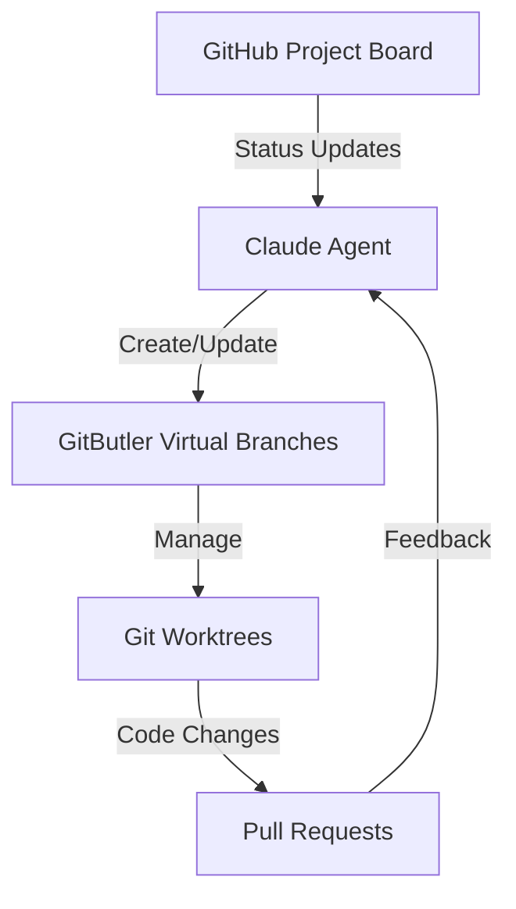

# Claude + GitButler Integration

This document describes how Claude AI agents work with GitButler and git worktrees in our development workflow.

## Overview

The integration combines:

1. Claude AI agents for code generation and review
2. GitButler for virtual branch management
3. Git worktrees for parallel development
4. GitHub Project board for task tracking

## Architecture



## Components

### 1. Claude Agent

- Handles code generation and review
- Manages virtual branches through GitButler
- Synchronizes with project board status
- Co-authors commits with human developers

### 2. GitButler Integration

- Creates and manages virtual branches
- Tracks branch status and relationships
- Handles automatic commits and pushes
- Preserves work in progress

### 3. Git Worktrees

- Provides isolated development environments
- Enables parallel work on multiple features
- Auto-cleans up completed work
- Maintains clean working state

### 4. Project Board Integration

- Tracks work item status
- Automates card movement
- Syncs with PR status
- Maintains work history

## Workflow

1. **Starting Work**

   ```bash
   # Create new feature
   claude feature "Add user settings"

   # Fix a bug
   claude fix "Memory leak in encryption"

   # Security enhancement
   claude security "Improve key rotation"
   ```

2. **Development Flow**
   - Claude creates virtual branch in GitButler
   - GitButler assigns available worktree
   - Changes tracked in isolated environment
   - Automatic commits with co-authorship

3. **Review Process**
   - PR created from virtual branch
   - Claude reviews code changes
   - Project board updates automatically
   - Feedback loop with human developers

4. **Completion**
   - Merged changes clean up virtual branch
   - Worktree recycled for new work
   - Project board card moves to Done
   - Work history preserved

## Configuration

The integration is configured through two main files:

1. `.github/claude-gitbutler.yml`
   - Branch templates
   - Worktree settings
   - Commit templates
   - Notification rules

2. `.github/scripts/claude-gitbutler-agent.mjs`
   - Integration logic
   - State management
   - Event handling
   - Error recovery

## Usage Examples

```bash
# Start new feature
claude feature "user-settings" "Add user preferences UI"

# Fix urgent bug
claude fix "memory-leak" "Fix encryption memory leak"

# Security enhancement
claude security "key-rotation" "Improve key rotation"

# Review PR
claude review 123

# Check status
claude status
```

## Best Practices

1. **Branch Naming**
   - Use descriptive, kebab-case names
   - Include type prefix (feature/, fix/, etc.)
   - Keep names concise but meaningful

2. **Commit Messages**
   - Follow conventional commits
   - Include testing notes
   - Document security implications
   - Credit co-authors

3. **Worktree Management**
   - Use dedicated worktrees per domain
   - Clean up completed work
   - Don't mix concerns
   - Preserve work in progress

4. **Project Board**
   - Keep cards up to date
   - Use labels consistently
   - Link related items
   - Document decisions

## Troubleshooting

Common issues and solutions:

1. **Virtual Branch Conflicts**

   ```bash
   # Force cleanup
   claude cleanup --force <branch-name>
   ```

2. **Worktree Issues**

   ```bash
   # Reset worktree
   claude worktree reset <path>
   ```

3. **State Sync**
   ```bash
   # Resync all state
   claude sync --all
   ```

## Support

For issues or questions:

1. Check logs in `.git/gitbutler/logs`
2. Review Claude agent output
3. File issue with details
4. Tag relevant maintainers
