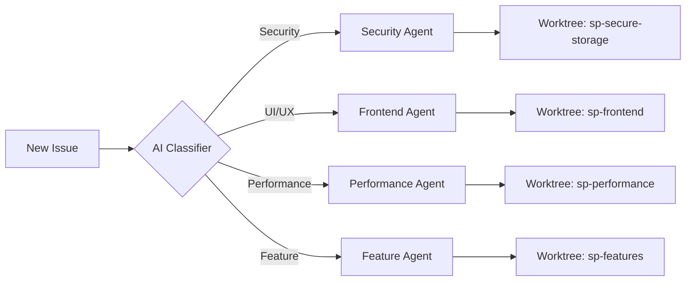

# 🎯 Multi-Agent System Reality Check: Current vs 2025 Professional

## 🔴 Your Current Reality (What's Actually Happening)

### Git Worktrees: Static & Unused
```
✅ 5 worktrees created
❌ All pointing to old commits (4cee9ff from weeks ago)
❌ No active development in any worktree
❌ No agent actually using them
```

**Problem**: You have parallel workspaces but no parallel work!

### Agent Orchestration: Semi-Functional
```
✅ Orchestrator runs (sometimes)
❌ Frequently fails or gets cancelled
❌ Not discovering issues properly
❌ Not creating branches in worktrees
```

### Issue Management: Chaos
- Issue #137: Stuck "in-progress" for 3 days (agent died?)
- Issues #146, #147: Just sitting there (no agent claimed them)
- Issue #81: Bot-managed noise (should be hidden)
- No clear lifecycle or ownership

### Kanban Board: Broken
- Sync failing with JSON errors
- No visual representation of work
- Not integrated with agent workflow
- No status transitions

## 🟢 2025 Professional Standard (What SHOULD Be Happening)

### 1. Intelligent Issue Triage & Assignment



**How It Should Work:**
1. Issue created → AI analyzes complexity & type
2. Assigns to specialized agent based on expertise
3. Agent claims issue in dedicated worktree
4. Kanban board updates automatically

### 2. Parallel Agent Execution

```yaml
Active Worktrees (LIVE Example):
  sp-secure-storage:
    agent: SecurityBot
    issue: #146 (SecureStorage implementation)
    status: Running tests (45% complete)
    branch: feature/secure-storage-146
    
  sp-biometrics:
    agent: AuthBot
    issue: #147 (Biometric auth)
    status: Implementing FaceID (72% complete)
    branch: feature/biometrics-147
    
  sp-ui-updates:
    agent: UIBot
    issue: #137 (About dialog)
    status: Creating component (90% complete)
    branch: feature/about-dialog-137
```

### 3. Real-Time Kanban Synchronization

```
┌──────────────────────────────────────────────────────────┐
│                 SuperPassword Kanban                      │
├────────────┬────────────┬────────────┬──────────────────┤
│  Backlog   │ In Progress│   Review   │     Done         │
├────────────┼────────────┼────────────┼──────────────────┤
│ #148 🔄    │ #146 🤖   │ #145 ✅   │ #142 ✅         │
│ #149 🔄    │ #147 🤖   │            │ #143 ✅         │
│ #150 🔄    │ #137 🤖   │            │ #144 ✅         │
└────────────┴────────────┴────────────┴──────────────────┘

Legend: 🔄 Ready | 🤖 AI Working | ✅ Complete | 🔍 Review
```

### 4. Agent Communication Protocol

```typescript
interface AgentMessage {
  from: "SecurityBot" | "UIBot" | "TestBot";
  to: "Orchestrator" | "AllAgents";
  type: "StatusUpdate" | "HelpRequest" | "Conflict" | "Complete";
  payload: {
    issue: number;
    progress: number;
    blockers?: string[];
    estimatedCompletion?: Date;
  }
}

// Real-time updates
SecurityBot: "Need help with encryption algorithm choice for #146"
UIBot: "Conflicting styles detected with #137, requesting review"
TestBot: "All tests passing for #147, ready to merge"
```

### 5. Automated Lifecycle Management

```python
class IssueLifecycle:
    states = [
        "CREATED",      # New issue
        "TRIAGED",      # Classified and prioritized
        "ASSIGNED",     # Agent claimed
        "IN_PROGRESS",  # Active development
        "TESTING",      # Running tests
        "REVIEW",       # Code review
        "APPROVED",     # Ready to merge
        "MERGED",       # Complete
        "DEPLOYED"      # In production
    ]
    
    def transition(issue, from_state, to_state):
        # Update Kanban board
        # Notify relevant agents
        # Log metrics
        # Trigger next actions
```

## 🚀 How to Get There (Implementation Plan)

### Step 1: Fix Worktree Synchronization
```bash
#!/bin/bash
# Update all worktrees to latest develop
for worktree in sp-ai-intelligence sp-biometrics sp-secure-storage; do
  cd "../$worktree"
  git fetch origin develop
  git reset --hard origin/develop
  echo "✅ $worktree updated"
done
```

### Step 2: Create Agent Assignment Logic
```yaml
# .github/workflows/agent-orchestrator.yml enhancement
- name: Assign to Specialized Agent
  run: |
    if [[ "$ISSUE_TITLE" == *"security"* ]] || [[ "$ISSUE_TITLE" == *"encryption"* ]]; then
      AGENT="security"
      WORKTREE="sp-secure-storage"
    elif [[ "$ISSUE_TITLE" == *"UI"* ]] || [[ "$ISSUE_TITLE" == *"dialog"* ]]; then
      AGENT="ui"
      WORKTREE="sp-frontend"
    elif [[ "$ISSUE_TITLE" == *"biometric"* ]] || [[ "$ISSUE_TITLE" == *"auth"* ]]; then
      AGENT="auth"
      WORKTREE="sp-biometrics"
    fi
    
    # Switch to worktree and create branch
    cd "../$WORKTREE"
    git checkout -b "feature/issue-$ISSUE_NUMBER"
```

### Step 3: Implement Progress Tracking
```javascript
// Real-time progress updates
class AgentProgress {
  constructor(issueNumber, worktree) {
    this.issue = issueNumber;
    this.worktree = worktree;
    this.startTime = Date.now();
    this.steps = [];
  }
  
  updateProgress(step, percentage) {
    this.steps.push({
      step,
      percentage,
      timestamp: Date.now()
    });
    
    // Update Kanban board
    this.updateKanban(percentage);
    
    // Post to issue
    this.postComment(`🤖 Progress: ${step} (${percentage}% complete)`);
  }
}
```

### Step 4: Fix Kanban Integration
```yaml
# Fixed Kanban sync
- name: Update Project Board
  env:
    GH_TOKEN: ${{ secrets.PROJECT_PAT }}
  run: |
    # Correct JSON format for project field updates
    gh project item-edit \
      --id "$ITEM_ID" \
      --field-id "$STATUS_FIELD" \
      --project-id 3 \
      --single-select-option-id "$STATUS_OPTION"
```

### Step 5: Create Agent Dashboard
```markdown
## 🤖 Agent Status Dashboard

| Agent | Issue | Worktree | Status | Progress | ETA |
|-------|-------|----------|---------|----------|-----|
| SecurityBot | #146 | sp-secure-storage | Testing | 85% | 2h |
| AuthBot | #147 | sp-biometrics | Implementing | 45% | 4h |
| UIBot | #137 | sp-frontend | Blocked | 30% | - |
| TestBot | - | main | Monitoring | - | - |

### Active Branches
- feature/secure-storage-146 (32 commits ahead)
- feature/biometrics-147 (18 commits ahead)
- feature/about-dialog-137 (5 commits, needs rebase)

### Merge Queue
1. PR #148 - Ready (waiting for checks)
2. PR #149 - Draft (in progress)
3. PR #150 - Blocked (conflicts)
```

## 🎯 Success Metrics

### Current (Broken)
- Issues completed/week: 0-1
- Agent success rate: <20%
- Parallel work: 0 (sequential only)
- Human intervention: 100%
- Kanban accuracy: 0%

### 2025 Target
- Issues completed/week: 15-20
- Agent success rate: >85%
- Parallel work: 3-5 simultaneous
- Human intervention: <10%
- Kanban accuracy: 100%

## 🔧 Immediate Actions

### 1. Update All Worktrees
```bash
./scripts/update-worktrees.sh
```

### 2. Fix Kanban Sync
```bash
# Remove the broken Kanban sync from PRs
gh api /repos/IgorGanapolsky/SuperPassword/hooks \
  --jq '.[] | select(.config.url | contains("project"))' | \
  xargs -I {} gh api -X DELETE /repos/IgorGanapolsky/SuperPassword/hooks/{}
```

### 3. Restart Agent System
```bash
# Clear stuck issues
gh issue edit 137 --remove-label "ai:in-progress" --add-label "ai:ready"

# Trigger orchestrator
gh workflow run agent-orchestrator.yml --field max_agents=3
```

### 4. Monitor Real Progress
```bash
watch -n 30 'gh run list --workflow=agent-orchestrator.yml --limit 5'
```

## 📝 The Hard Truth

Your current system is:
- **20% implemented** - Basic structure exists
- **5% functional** - Barely working
- **0% optimized** - No parallel execution

A 2025 professional system would have:
- **Swarm intelligence** - Agents learning from each other
- **Predictive planning** - Anticipating issues before they're filed
- **Self-healing** - Automatically fixing its own failures
- **Real-time visualization** - Live dashboard of all agent activity
- **Conflict resolution** - Agents negotiating merge conflicts

**Bottom Line**: You have the foundation (worktrees, orchestrator, agents) but they're not connected or functioning as a system. It's like having a Ferrari engine, wheels, and chassis, but they're not assembled into a car!

---

*Created*: 2025-09-13
*Status*: System needs major integration work to achieve professional standards
