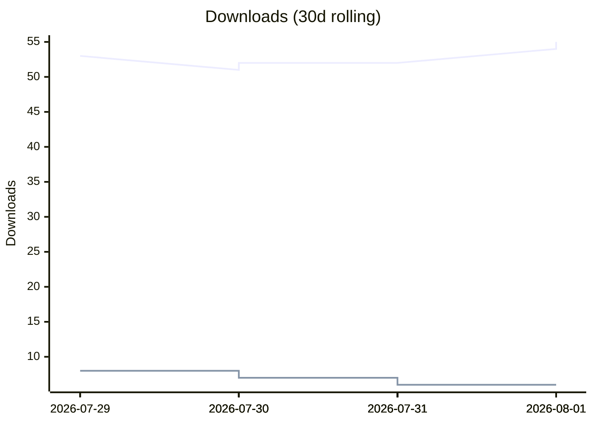
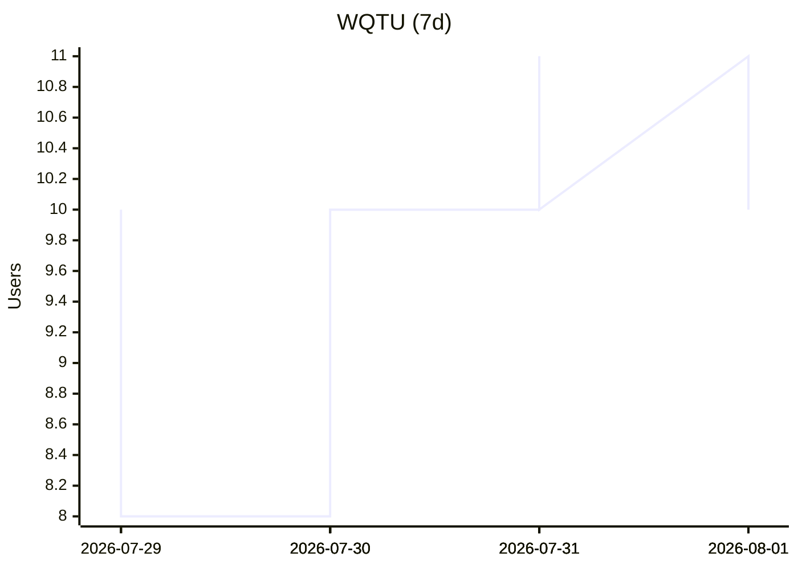
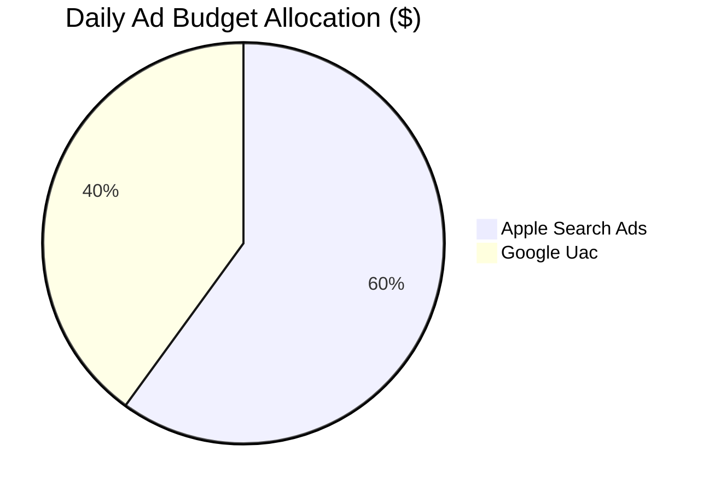
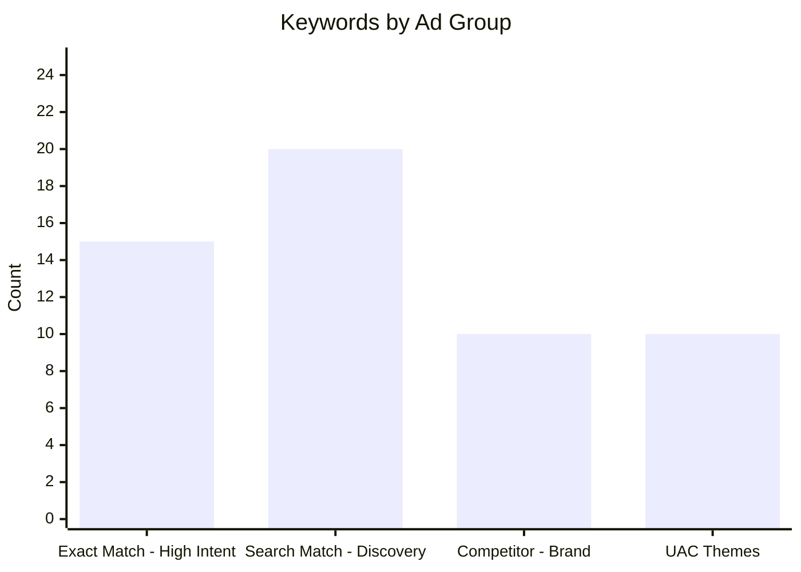
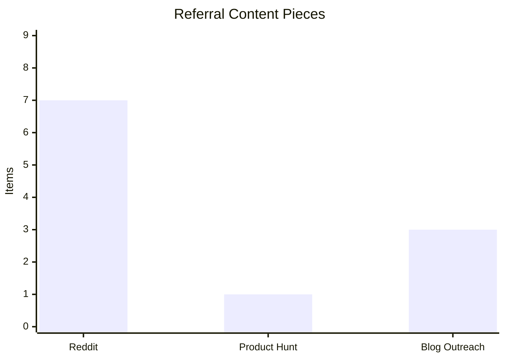

# Daily Metrics Dashboard

> **Auto-updated** by the `wiki-sync.yml` workflow. Data sourced from `marketing/data/` JSON files and PostHog attribution reports.

## Downloads & Active Users

<!-- DOWNLOADS_START -->
| Metric | iOS | Android | Combined |
|--------|:---:|:-------:|:--------:|
| Distinct install users (30d) | 55 | 6 | 61 |
| Active Installs | — | 11 | — |

| Active Users | Count |
|-------------|:-----:|
| DAU | 4 |
| WAU | 25 |
| MAU | 78 |
<!-- DOWNLOADS_END -->

## North Star (WQTU)

<!-- NORTH_STAR_START -->
| Metric | Value |
|--------|-------|
| WQTU (7d) | 10 |
| Timer Completed (7d) | 219 |
| Completed Users (7d) | 13 |
| Sessions/Completed User (7d) | 16.85 |
| Checkpoint Target (2026-03-31) | 8 |
| Quarter Target (2026-06-30) | 25 |
| Paid Attributed Users (30d) | 0 |
| Active Campaign Count | 0 |
| Guardrail Violated | NO |
<!-- NORTH_STAR_END -->

## Attribution Summary

<!-- ATTRIBUTION_START -->
# Attribution Feedback Report

**Generated:** 2026-08-01T18:27:51+00:00

## Onboarding Funnel
- First Open: **64**
- First Timer Configured: **49** (76.6% of opens)
- First Timer Completed: **40** (62.5% of opens)

## UTM Attribution (Top Sources)
| Source | Medium | Campaign | Installs | Unique Users |
|--------|--------|----------|----------|-------------|

## Campaign Performance
| Campaign | Source | Attributed | Activated | Rate |
|----------|--------|-----------|-----------|------|

<!-- ATTRIBUTION_END -->

## Paywall & Revenue Funnel (30-day)

<!-- PAYWALL_START -->
| Metric | Value |
|--------|-------|
| Paywall Views | 42 |
| Offer Selects | 4 |
| Purchase Attempts | 2 |
| Purchase Successes | 1 |
| Attempt → Success | 50.0% |

**Top failure reasons:** failed (1), user_cancelled (1)

**Catalog failures (Android):** pro_base (2)
<!-- PAYWALL_END -->

## Onboarding Funnel (30-day window)

<!-- FUNNEL_START -->
| Step | Users | Conversion |
|------|:-----:|:----------:|
| First Open | 64 | — |
| First Timer Configured | 49 | 76.6% of opens |
| First Timer Completed | 40 | 62.5% of opens |
<!-- FUNNEL_END -->

## Review Velocity

<!-- REVIEWS_START -->
| Platform | Total Reviews | Avg Rating | 7-day Velocity |
|----------|:------------:|:----------:|:--------------:|
| iOS | 1 | 5.0 | — reviews/day |
| Android | 1 | 5.0 | 1.0 reviews/day |

**Prompt Config:** Show after 3 completions, 30 days between prompts
<!-- REVIEWS_END -->

## Active CRO Experiments

<!-- CRO_START -->
| Experiment | Platform | Status | Duration |
|-----------|----------|--------|----------|
| title_ab_test | android | proposed | 14 days |
| short_description_ab_test | android | proposed | 14 days |
| screenshot_ab_test | both | proposed | 21 days |
| title_ab_test | android | proposed | 14 days |
| short_description_ab_test | android | proposed | 14 days |
| screenshot_ab_test | both | proposed | 21 days |
| title_ab_test | android | proposed | 14 days |
| short_description_ab_test | android | proposed | 14 days |
| screenshot_ab_test | both | proposed | 21 days |
<!-- CRO_END -->

## Paid Campaign Status

<!-- CAMPAIGNS_START -->
| Platform | Daily Budget | Status | Keywords |
|----------|:-----------:|--------|:--------:|
| apple_search_ads | $18.00 | paused | 45 |
| google_uac | $12.00 | ready_to_launch | 10 |
| reddit_ads | $0.00 | ready_to_launch | 0 |
| **Total** | **$30.00** | — | 55 |
<!-- CAMPAIGNS_END -->

## ASO Keywords

<!-- ASO_START -->
**iOS (current):** `bjj,hiit,sparring,wrestling,muaythai,tabata,crossfit,reaction,jiujitsu,wod,kickboxing`

**Last rotation:** —
**Performing:** — | **Replaced:** —
<!-- ASO_END -->

## Content Pipeline

<!-- CONTENT_START -->
| Metric | Value |
|--------|-------|
| Total Posts Published | 1 |
| Latest Post | The inspiration behind Random Tactical Timer |
| Published At | 2026-02-19T19:31:07+00:00 |
<!-- CONTENT_END -->

## Referral Campaigns

<!-- REFERRAL_START -->
| Channel | Items | Status |
|---------|:-----:|--------|
| Reddit Posts | 7 | draft |
| Product Hunt | 1 | draft |
| Blog Outreach | 3 | draft |
<!-- REFERRAL_END -->

## Charts

<!-- CHARTS_START -->

<!-- CHARTS_END -->

---

_Dashboard generated at: `2026-08-01T18:27:52+00:00`. Data refreshed daily by [`wiki-sync.yml`](https://github.com/IgorGanapolsky/Random-Timer/actions/workflows/wiki-sync.yml)._
