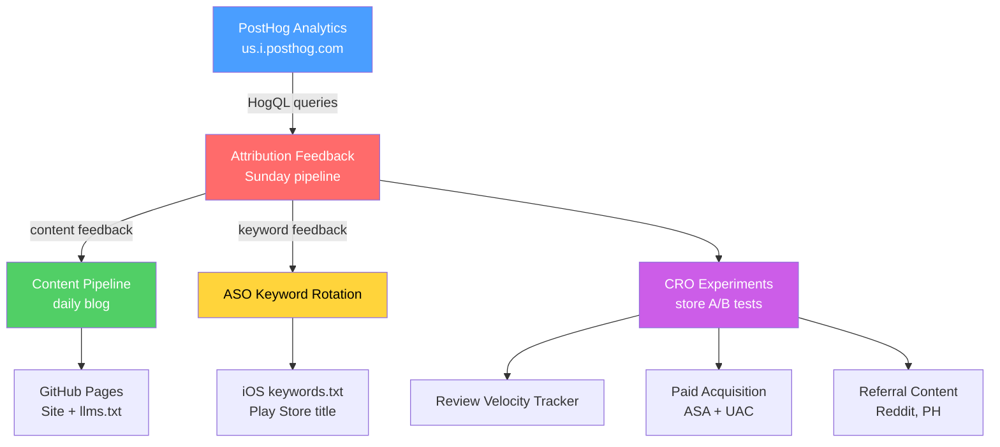

# Growth Systems Overview

Automated growth infrastructure running via GitHub Actions on fixed schedules.

## Weekly Pipeline Calendar

| Day | Time (UTC) | Workflow | Script | Purpose |
|-----|-----------|---------|--------|---------|
| **Sunday** | 00:00 | `analytics.yml` | — | CI/CD health report (success rates, build times, security) |
| **Sunday** | 08:00 | `weekly-attribution-feedback.yml` | `attribution_feedback.py` | PostHog → keyword feedback + content feedback |
| **Daily** | 14:10 | `north-star-guardrail.yml` | `north_star_guardrail.py` + `attribution_feedback.py` + `north_star_ops.py` | Refresh North Star, funnel snapshot, and prioritized next action |
| **Monday** | 14:40 | `weekly-north-star-experiment.yml` | `north_star_guardrail.py` + `attribution_feedback.py` + `north_star_ops.py` + `north_star_experiment.py` | Generate one measurable weekly activation/retention experiment brief |
| **Monday** | 10:00 | `weekly-aso-rotation.yml` | `aso_keyword_rotation.py` | Rotate underperforming iOS keywords |
| **Tuesday** | 11:00 | `weekly-cro-optimization.yml` | `cro_optimization.py` | Propose/track A/B experiments for store listings |
| **Wednesday** | 09:00 | `weekly-review-velocity.yml` | `review_velocity_tracker.py` | Track review rates, tune prompt config |
| **Thursday** | 12:00 | `weekly-paid-acquisition.yml` | `paid_acquisition_seed.py` | Refresh Apple Search Ads + Google UAC campaigns |
| **Friday** | 14:00 | `weekly-referral-content.yml` | `backlinks_referral.py` | Generate Reddit posts, PH launch, blog outreach |
| **Daily** | 13:15 | `daily-growth-publishing.yml` | `growth_content_pipeline.py` | Publish blog, build Pages site, collect engagement |

## System Architecture

## Data Files (marketing/data/)

| File | Updated By | Contents |
|------|-----------|---------|
| `cro_experiments.json` | `cro_optimization.py` | A/B test definitions and status |
| `review_velocity.json` | `review_velocity_tracker.py` | Review snapshots, velocity, prompt config |
| `paid_campaigns.json` | `paid_acquisition_seed.py` | ASA + UAC campaign configs |
| `referral_campaigns.json` | `backlinks_referral.py` | Reddit posts, PH launch, blog outreach |
| `localization_status.json` | `cro_optimization.py` | Metadata completion per locale |
| `posts.jsonl` | `growth_content_pipeline.py` | Published blog post index |
| `content_feedback.json` | `attribution_feedback.py` | Campaign activation rankings |
| `north_star_ops.json` | `north_star_ops.py` | Current bottleneck + next highest-ROI action |
| `north_star_ops.md` | `north_star_ops.py` | Human-readable daily ops report |
| `north_star_experiment.json` | `north_star_experiment.py` | Single weekly experiment brief tied to NSM gap |
| `north_star_experiment.md` | `north_star_experiment.py` | Human-readable experiment plan + proof commands |
| `attribution-report.md` | `attribution_feedback.py` | Weekly attribution summary |

## Keyword Data (marketing/keywords/)

| File | Updated By | Contents |
|------|-----------|---------|
| `strategy.json` | Manual | Seed keywords + modifiers for BID scoring |
| `posthog_feedback.json` | `attribution_feedback.py` | Real install data per keyword |
| `rotation_history.json` | `aso_keyword_rotation.py` | History of keyword swaps |

## Localization Coverage

| Locale | Android Title | Android Short Desc | iOS Name | iOS Subtitle |
|--------|:---:|:---:|:---:|:---:|
| en-US | ✅ | ✅ | ✅ | ✅ |
| ja | ✅ | ✅ | ✅ | ✅ |
| de-DE | ✅ | ✅ | ✅ | ✅ |
| ko | ✅ | ✅ | ✅ | ✅ |
| pt-BR | ✅ | ✅ | ✅ | ✅ |
