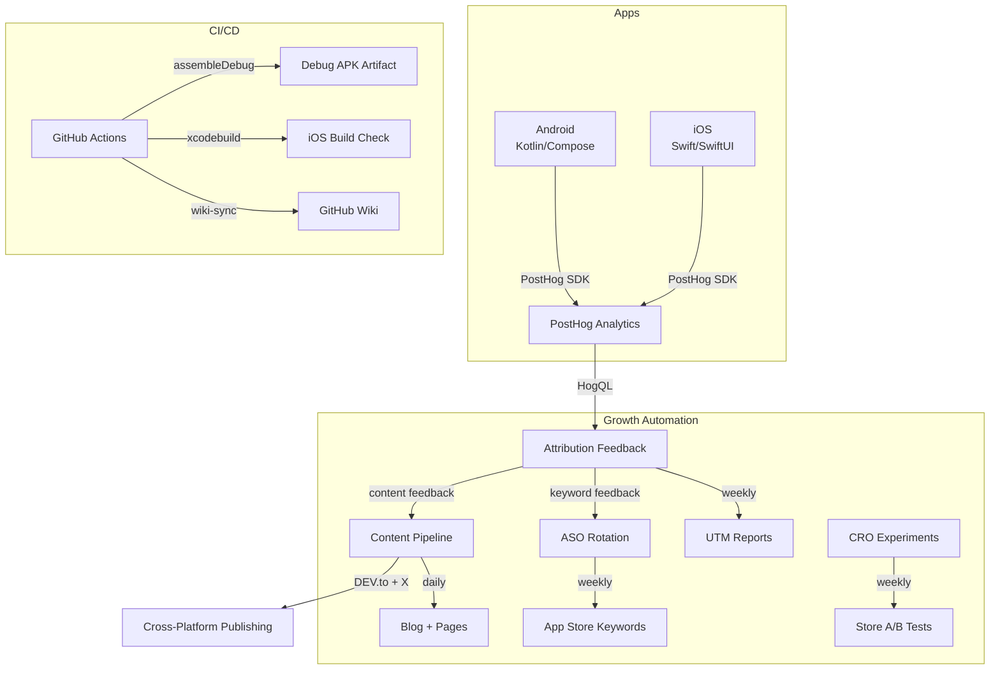
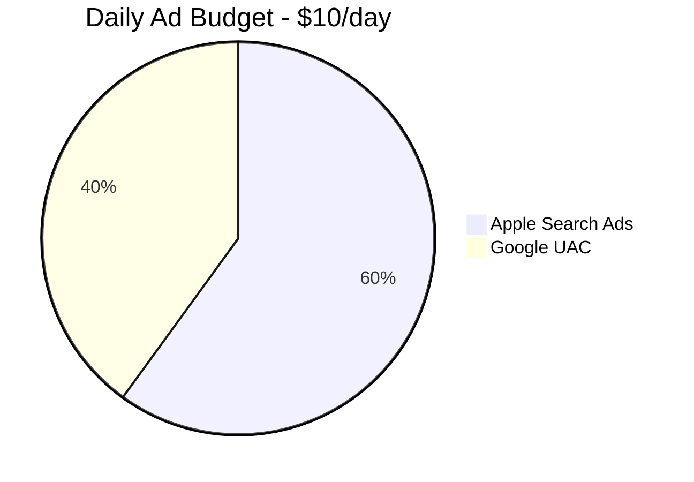

# Random Tactical Timer — Wiki

Welcome to the Random Timer project wiki. These pages are **auto-updated daily** by GitHub Actions from live PostHog analytics and marketing pipeline data.

## Project Architecture

## Budget Allocation

## Navigation

### Analytics & Measurement
- [[Analytics Events Reference]] — Every PostHog event tracked across Android & iOS
- [[Attribution & UTM Pipeline]] — How marketing spend maps to installs and activation
- [[Onboarding Funnel]] — First Open → First Configure → First Complete conversion rates

### Growth Systems
- [[Growth Systems Overview]] — All automated growth pipelines and their schedules
- [[ASO Keyword Rotation]] — Weekly keyword performance and rotation history
- [[Review Velocity]] — App store review rates and prompt tuning
- [[CRO Experiments]] — A/B test proposals and results for store listings

### Campaign Performance
- [[Paid Acquisition]] — Apple Search Ads & Google UAC campaign configs and spend
- [[Referral & Content]] — Reddit, Product Hunt, blog outreach campaign status
- [[Content Pipeline]] — Daily blog publishing metrics and engagement

### Daily Dashboard
- [[Daily Metrics Dashboard]] — Auto-generated summary with live data from PostHog + marketing JSON

## Recent Cleanup (2026-02-23)

| Action | Branch | Result |
|--------|--------|--------|
| Merged | `fix/metadata-gaps` via PR #439 | Metadata sync rewrite + localized descriptions + A/B pilot |
| Deleted | `claude/power-button-silence-alarm-TxDrs` | Feature already on develop; overloaded branch removed |
| Deleted | `auto/growth-publishing-20260222-1331` | Auto-generated content with broken links |

**Repo health:** 2 core branches (`main`, `develop`), both CI green.

---

_Last synced by [`wiki-sync.yml`](https://github.com/IgorGanapolsky/Random-Timer/actions/workflows/wiki-sync.yml) workflow._
