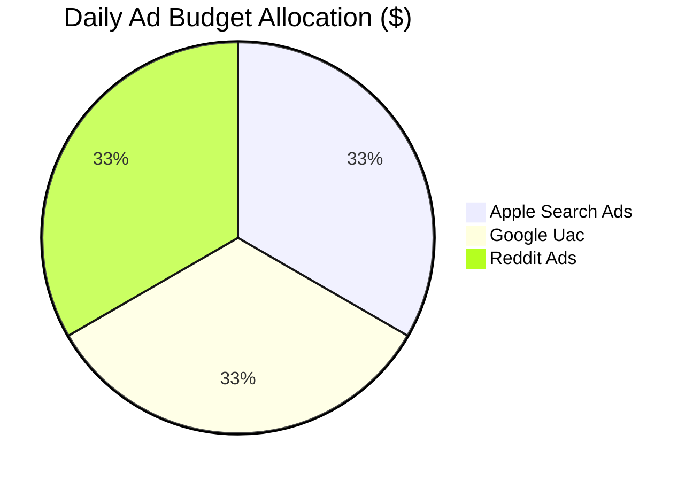
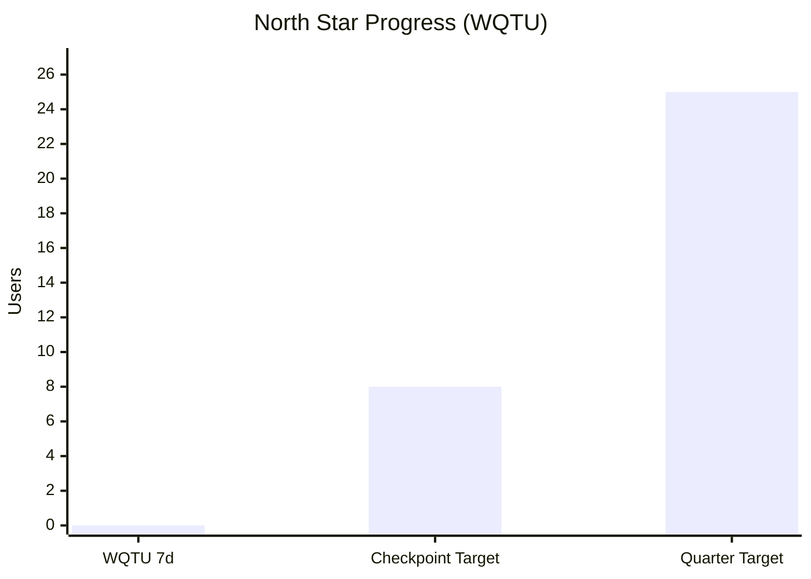

# Paid Acquisition

Campaign configurations and live paid performance for Apple Search Ads and Google Universal App Campaigns.

> Auto-updated by `scripts/wiki_sync.py` from `marketing/data/*.json`.

## Live Paid Snapshot

<!-- LIVE_PAID_START -->
| Metric | Value |
|--------|-------|
| Snapshot (UTC) | `2026-02-24T15:48:03+00:00` |
| Paid Attributed Users (30d) | 0 |
| Paid Events (30d) | 0 |
| Active Campaign Count (tracked) | 0 |
| Daily Budget Configured | $30.00 |
| Blended CPI Target | $3.00 |
| Open -> Completed Rate (30d) | 24.2% |
| WQTU (7d) | 0 |
| WQTU Checkpoint Target (2026-03-31) | 8 |
| WQTU Quarter Target (2026-06-30) | 25 |
| Downloads (30d) | 8 |
| Apple Ads Live Finding | You do not have any campaigns |
| Guardrail Violated | NO |
<!-- LIVE_PAID_END -->

## Paid Attribution Sources (30d)

<!-- LIVE_PAID_SOURCES_START -->
| Source | Events (30d) | Users (30d) |
|--------|:------------:|:-----------:|
| (none) | 0 | 0 |
<!-- LIVE_PAID_SOURCES_END -->

## Paid Charts

<!-- LIVE_PAID_CHARTS_START -->

<!-- LIVE_PAID_CHARTS_END -->

## Budget Allocation

| Platform | Daily Budget | Share |
|----------|:-----------:|:-----:|
| Apple Search Ads | $6.00 | 60% |
| Google UAC | $4.00 | 40% |
| **Total** | **$10.00/day** | 100% |

**Target CPA:** $3.00 | **Max CPT (Apple):** $1.50

## Apple Search Ads — 3 Ad Groups

### Exact Match (High-Intent)
Top 15 keywords with BID ≥ 60. Examples:
- `reaction timer app`, `random interval timer`, `tactical timer`, `hiit random timer`

### Search Match (Discovery)
Top 20 keywords with BID 40–60. Broad match for keyword discovery.

### Competitor/Brand
Top 10 commercial + tool intent keywords targeting competitor searches.

**Negative keywords:** `egg timer`, `kitchen timer`, `countdown timer free`, `clock`, `stopwatch`

## Google UAC

**Headlines:**
- Random Tactical Timer
- Unpredictable HIIT & Reaction Drills
- Train with Random Intervals

**Descriptions:**
- Set a random countdown. Train reaction time, run boxing drills, or play party games.
- The timer app that keeps you on edge. Random intervals for HIIT, martial arts, and more.

**Targeting:** US, GB, CA, AU, DE | **Optimization goal:** Installs

## Campaign Status

All campaigns currently in **draft** status. Activation requires:
1. Apple Search Ads account setup
2. Google Ads UAC account setup
3. Budget approval
4. App published to both stores

## Source Files

- `scripts/paid_acquisition_seed.py` — Campaign config generation
- `marketing/data/paid_campaigns.json` — Campaign data
- `.github/workflows/weekly-paid-acquisition.yml` — Thursday 12:00 UTC
